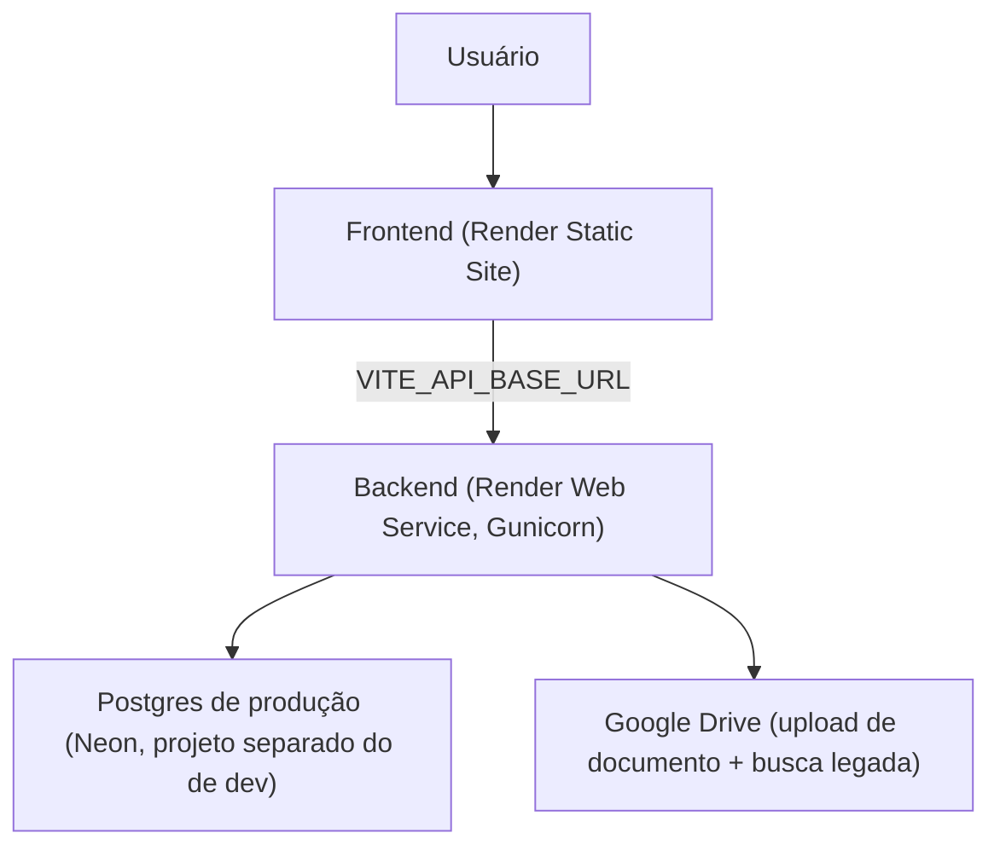

# APP HUB — Arquitetura (mapa de dependências)

> **Documentos relacionados:** [[VISAO]] · [[PROGRESS]] · [[API_CONTRACTS]] · [[DEPLOY]] · [[RATEIO]] · [[PENDENCIAS]] · [[CONTRIBUTING]] · [[README]]

Este arquivo existe pra dar contexto rápido (pra humano ou IA) de **quem chama quem** no backend, sem precisar abrir todos os arquivos. Atualize aqui sempre que criar um domínio novo (rota+service+model) — é mais rápido manter isso em dia do que reconstruir o raciocínio do zero numa sessão futura.

## Mapa por domínio

```mermaid
graph TD
  subgraph Auth["Autenticação"]
    AuthRoutes["auth_routes.py"] --> AuthService["auth_service.py"]
    AuthService --> UserModel["models/user.py"]
    OAuthRoutes["oauth_routes.py"] --> OAuthService["oauth_service.py"]
    OAuthService --> GoogleAccountModel["models/google_account.py"]
  end

  subgraph Clientes["Clientes"]
    ClientRoutes["client_routes.py"] --> ClientService["client_service.py"]
    ClientService --> ClientModel["models/client.py"]
    ClientService -.reaproveita.-> UcService
  end

  subgraph UCs["UCs"]
    UcRoutes["uc_routes.py"] --> UcService["uc_service.py"]
    UcService --> ConsumerUnitModel["models/consumer_unit.py"]
  end

  subgraph Usinas["Usinas"]
    PlantRoutes["plant_routes.py"] --> PlantService["plant_service.py"]
    PlantService --> PlantModel["models/plant.py"]
    PlantRoutes -.remove conexao.-> UcService
  end

  subgraph Rateio["Rateio"]
    RateioRoutes["rateio_routes.py"] --> RateioService["rateio_service.py"]
    RateioService --> PlantModel
    RateioService --> ConsumerUnitModel
    RateioService --> RateioHistoricoModel["models/rateio_historico.py"]
  end

  subgraph Documentos["Documentos"]
    DocumentRoutes["document_routes.py"] --> DocumentService["document_service.py"]
    DocumentService --> DriveService["drive_service.py"]
    DocumentService --> DocumentModel["models/document.py"]
  end

  subgraph Pendencias["Pendências"]
    PendenciaRoutes["pendencia_routes.py"] --> PendenciaService["pendencia_service.py"]
    PendenciaRoutes --> AutomacaoService["automacao_service.py"]
    PendenciaService --> PendenciaModel["models/pendencia.py"]
  end

  subgraph Identidade["Empresa / Usuários / Convites"]
    EmpresaRoutes["empresa_routes.py"] --> EmpresaService["empresa_service.py"]
    UserRoutes["user_routes.py"] --> UserService["user_service.py"]
    InvitationRoutes["invitation_routes.py"] --> InvitationService["invitation_service.py"]
    EmpresaService --> EmpresaModel["models/empresa.py"]
    UserService --> UserModel
  end

  TenantMixin["extensions.py — TenantMixin"] -.filtro automatico por empresa_id.-> ClientModel
  TenantMixin -.filtro automatico.-> ConsumerUnitModel
  TenantMixin -.filtro automatico.-> PlantModel
  TenantMixin -.filtro automatico.-> DocumentModel
  TenantMixin -.filtro automatico.-> PendenciaModel
```



## Onde procurar cada coisa

| Preciso mexer em... | Vou em... |
|---|---|
| Regra de negócio de Cliente/UC/Usina | `backend/services/*_service.py` |
| Validação de campo obrigatório numa rota | `backend/routes/*_routes.py` (validação de entrada) + o service (regra de fato) |
| Campo novo no banco | `backend/models/*.py` + migration em `backend/migrations/versions/` |
| Tela/formulário no frontend | `frontend/src/pages/` (tela) → `frontend/src/components/` (peça reutilizável) → `frontend/src/services/*Service.ts` (chamada HTTP) |
| Cálculo do rateio | `backend/services/rateio_service.py` (motor) — ver também [[RATEIO]] pra especificação de negócio |
| Multi-tenant / isolamento por empresa | `backend/extensions.py` (`TenantMixin`) — ver [[SPRINT_02]] |

## Convenção de nomenclatura (pra IA nova entender rápido)

- Termos de domínio ficam em português nos models/services (`rateio`, `usina`, `concessionária`) — ver seção "Key domain terminology" no histórico de memória do João, ou perguntar direto.
- `qualificado`/`qualificação` substituiu `elegível`/`elegibilidade` em todo o código — não reintroduzir o termo antigo.
```

---

## Mapa gerado automaticamente

A seção abaixo é escrita sozinha toda vez que você roda `python hub.py iniciar` — reflete os imports reais do código naquele momento. Não editar na mão (a próxima vez que o HUB iniciar, ela é sobrescrita).

<!-- MAPA-AUTO:INICIO -->
> Gerado automaticamente por `python hub.py iniciar` (`comandos/mapear.py`) -- nao editar esta secao na mao, a proxima execucao sobrescreve.

### Backend (imports reais entre routes / services / models / utils)

```mermaid
graph TD
  subgraph models["models"]
    models_category["models.category"]
    models_client["models.client"]
    models_consumer_unit["models.consumer_unit"]
    models_document["models.document"]
    models_drive_item["models.drive_item"]
    models_empresa["models.empresa"]
    models_google_account["models.google_account"]
    models_invitation["models.invitation"]
    models_log_entry["models.log_entry"]
    models_password_reset_token["models.password_reset_token"]
    models_pendencia["models.pendencia"]
    models_plant["models.plant"]
    models_rateio_historico["models.rateio_historico"]
    models_setting["models.setting"]
    models_user["models.user"]
  end
  subgraph raiz["raiz"]
    app["app"]
    config["config"]
    extensions["extensions"]
  end
  subgraph routes["routes"]
    routes_auth_routes["routes.auth_routes"]
    routes_category_routes["routes.category_routes"]
    routes_client_routes["routes.client_routes"]
    routes_config_routes["routes.config_routes"]
    routes_document_routes["routes.document_routes"]
    routes_drive_routes["routes.drive_routes"]
    routes_empresa_routes["routes.empresa_routes"]
    routes_health_routes["routes.health_routes"]
    routes_invitation_routes["routes.invitation_routes"]
    routes_log_routes["routes.log_routes"]
    routes_oauth_routes["routes.oauth_routes"]
    routes_pendencia_routes["routes.pendencia_routes"]
    routes_plant_routes["routes.plant_routes"]
    routes_platform_routes["routes.platform_routes"]
    routes_rateio_routes["routes.rateio_routes"]
    routes_settings_routes["routes.settings_routes"]
    routes_uc_routes["routes.uc_routes"]
    routes_user_routes["routes.user_routes"]
  end
  subgraph services["services"]
    services_auth_service["services.auth_service"]
    services_automacao_service["services.automacao_service"]
    services_client_service["services.client_service"]
    services_database_config_service["services.database_config_service"]
    services_document_service["services.document_service"]
    services_drive_service["services.drive_service"]
    services_email_service["services.email_service"]
    services_email_templates["services.email_templates"]
    services_empresa_service["services.empresa_service"]
    services_invitation_service["services.invitation_service"]
    services_log_service["services.log_service"]
    services_oauth_service["services.oauth_service"]
    services_password_reset_service["services.password_reset_service"]
    services_pendencia_service["services.pendencia_service"]
    services_permission_service["services.permission_service"]
    services_plant_service["services.plant_service"]
    services_rateio_service["services.rateio_service"]
    services_settings_service["services.settings_service"]
    services_uc_service["services.uc_service"]
    services_user_service["services.user_service"]
  end
  subgraph utils["utils"]
    utils_api_response["utils.api_response"]
    utils_auth["utils.auth"]
    utils_crypto["utils.crypto"]
    utils_files["utils.files"]
  end
  app --> config
  app --> extensions
  app --> models_category
  app --> models_client
  app --> models_consumer_unit
  app --> models_document
  app --> models_empresa
  app --> models_google_account
  app --> models_invitation
  app --> models_log_entry
  app --> models_password_reset_token
  app --> models_pendencia
  app --> models_plant
  app --> models_rateio_historico
  app --> models_setting
  app --> models_user
  app --> routes_auth_routes
  app --> routes_category_routes
  app --> routes_client_routes
  app --> routes_config_routes
  app --> routes_document_routes
  app --> routes_drive_routes
  app --> routes_empresa_routes
  app --> routes_health_routes
  app --> routes_invitation_routes
  app --> routes_log_routes
  app --> routes_oauth_routes
  app --> routes_pendencia_routes
  app --> routes_plant_routes
  app --> routes_platform_routes
  app --> routes_rateio_routes
  app --> routes_settings_routes
  app --> routes_uc_routes
  app --> routes_user_routes
  app --> utils_auth
  models_category --> extensions
  models_client --> extensions
  models_consumer_unit --> extensions
  models_document --> extensions
  models_empresa --> extensions
  models_google_account --> extensions
  models_google_account --> utils_crypto
  models_invitation --> extensions
  models_log_entry --> extensions
  models_password_reset_token --> extensions
  models_pendencia --> extensions
  models_plant --> extensions
  models_rateio_historico --> extensions
  models_setting --> extensions
  models_user --> extensions
  routes_auth_routes --> extensions
  routes_auth_routes --> models_empresa
  routes_auth_routes --> services_auth_service
  routes_auth_routes --> services_invitation_service
  routes_auth_routes --> services_password_reset_service
  routes_auth_routes --> services_user_service
  routes_auth_routes --> utils_api_response
  routes_auth_routes --> utils_auth
  routes_category_routes --> extensions
  routes_category_routes --> models_category
  routes_category_routes --> utils_api_response
  routes_client_routes --> services_client_service
  routes_client_routes --> utils_api_response
  routes_config_routes --> services_database_config_service
  routes_config_routes --> services_drive_service
  routes_config_routes --> utils_api_response
  routes_document_routes --> services_document_service
  routes_document_routes --> utils_api_response
  routes_drive_routes --> services_drive_service
  routes_drive_routes --> utils_api_response
  routes_empresa_routes --> config
  routes_empresa_routes --> models_empresa
  routes_empresa_routes --> models_user
  routes_empresa_routes --> services_empresa_service
  routes_empresa_routes --> utils_api_response
  routes_invitation_routes --> config
  routes_invitation_routes --> services_invitation_service
  routes_invitation_routes --> services_permission_service
  routes_invitation_routes --> utils_api_response
  routes_log_routes --> services_log_service
  routes_log_routes --> utils_api_response
  routes_oauth_routes --> config
  routes_oauth_routes --> services_log_service
  routes_oauth_routes --> services_oauth_service
  routes_oauth_routes --> utils_api_response
  routes_oauth_routes --> utils_auth
  routes_pendencia_routes --> services_automacao_service
  routes_pendencia_routes --> services_pendencia_service
  routes_pendencia_routes --> utils_api_response
  routes_plant_routes --> services_plant_service
  routes_plant_routes --> services_uc_service
  routes_plant_routes --> utils_api_response
  routes_platform_routes --> models_empresa
  routes_platform_routes --> services_permission_service
  routes_platform_routes --> utils_api_response
  routes_platform_routes --> utils_auth
  routes_rateio_routes --> services_rateio_service
  routes_rateio_routes --> utils_api_response
  routes_settings_routes --> services_settings_service
  routes_settings_routes --> utils_api_response
  routes_uc_routes --> services_uc_service
  routes_uc_routes --> utils_api_response
  routes_user_routes --> services_permission_service
  routes_user_routes --> services_user_service
  routes_user_routes --> utils_api_response
  services_auth_service --> extensions
  services_auth_service --> models_empresa
  services_auth_service --> models_user
  services_auth_service --> services_log_service
  services_auth_service --> utils_auth
  services_automacao_service --> extensions
  services_automacao_service --> models_client
  services_automacao_service --> models_consumer_unit
  services_automacao_service --> models_document
  services_automacao_service --> models_pendencia
  services_automacao_service --> services_log_service
  services_automacao_service --> services_pendencia_service
  services_client_service --> extensions
  services_client_service --> models_client
  services_client_service --> models_consumer_unit
  services_client_service --> services_uc_service
  services_document_service --> config
  services_document_service --> extensions
  services_document_service --> models_category
  services_document_service --> models_client
  services_document_service --> models_consumer_unit
  services_document_service --> models_document
  services_document_service --> services_drive_service
  services_document_service --> services_log_service
  services_drive_service --> config
  services_drive_service --> models_google_account
  services_drive_service --> services_database_config_service
  services_drive_service --> services_log_service
  services_drive_service --> utils_files
  services_email_service --> config
  services_email_service --> services_log_service
  services_empresa_service --> extensions
  services_empresa_service --> models_empresa
  services_empresa_service --> models_user
  services_empresa_service --> services_log_service
  services_empresa_service --> utils_auth
  services_invitation_service --> extensions
  services_invitation_service --> models_empresa
  services_invitation_service --> models_invitation
  services_invitation_service --> models_user
  services_invitation_service --> services_log_service
  services_invitation_service --> services_user_service
  services_invitation_service --> utils_auth
  services_log_service --> extensions
  services_log_service --> models_log_entry
  services_oauth_service --> config
  services_oauth_service --> extensions
  services_oauth_service --> models_google_account
  services_oauth_service --> models_setting
  services_oauth_service --> services_drive_service
  services_oauth_service --> services_log_service
  services_password_reset_service --> config
  services_password_reset_service --> extensions
  services_password_reset_service --> models_password_reset_token
  services_password_reset_service --> models_user
  services_password_reset_service --> services_email_service
  services_password_reset_service --> services_email_templates
  services_password_reset_service --> services_log_service
  services_password_reset_service --> utils_auth
  services_pendencia_service --> extensions
  services_pendencia_service --> models_pendencia
  services_pendencia_service --> services_log_service
  services_permission_service --> utils_api_response
  services_plant_service --> extensions
  services_plant_service --> models_plant
  services_rateio_service --> extensions
  services_rateio_service --> models_consumer_unit
  services_rateio_service --> models_plant
  services_rateio_service --> models_rateio_historico
  services_rateio_service --> services_log_service
  services_rateio_service --> services_settings_service
  services_settings_service --> extensions
  services_settings_service --> models_setting
  services_uc_service --> extensions
  services_uc_service --> models_client
  services_uc_service --> models_consumer_unit
  services_uc_service --> models_plant
  services_uc_service --> services_log_service
  services_user_service --> config
  services_user_service --> extensions
  services_user_service --> models_user
  services_user_service --> services_log_service
  services_user_service --> utils_auth
  utils_auth --> config
  utils_auth --> models_empresa
  utils_auth --> models_user
  utils_auth --> utils_api_response
  utils_crypto --> config
```



### Frontend (imports reais entre pages / components / services / hooks / layouts)

```mermaid
graph TD
  subgraph components["components"]
    components_CategoryPicker["components/CategoryPicker"]
    components_ClientCard["components/ClientCard"]
    components_ClientDetailView["components/ClientDetailView"]
    components_ClientDocumentsPanel["components/ClientDocumentsPanel"]
    components_DashboardCards["components/DashboardCards"]
    components_DataTable["components/DataTable"]
    components_DetailHeader["components/DetailHeader"]
    components_DocumentLinkModal["components/DocumentLinkModal"]
    components_ErrorBoundary["components/ErrorBoundary"]
    components_Header["components/Header"]
    components_Icon["components/Icon"]
    components_Loading["components/Loading"]
    components_PlantCard["components/PlantCard"]
    components_PlantConnectionsField["components/PlantConnectionsField"]
    components_PlantDistribuicaoModal["components/PlantDistribuicaoModal"]
    components_ReservedPanel["components/ReservedPanel"]
    components_ResultsList["components/ResultsList"]
    components_SearchPanel["components/SearchPanel"]
    components_Sidebar["components/Sidebar"]
    components_Toast["components/Toast"]
    components_UcCard["components/UcCard"]
    components_formFields["components/formFields"]
  end
  subgraph hooks["hooks"]
    hooks_useGlobalLoading["hooks/useGlobalLoading"]
    hooks_useToast["hooks/useToast"]
  end
  subgraph layouts["layouts"]
    layouts_BaseLayout["layouts/BaseLayout"]
  end
  subgraph pages["pages"]
    pages_AgendaPage["pages/AgendaPage"]
    pages_ClientsPage["pages/ClientsPage"]
    pages_DocumentsPage["pages/DocumentsPage"]
    pages_EmpresasPage["pages/EmpresasPage"]
    pages_LoginPage["pages/LoginPage"]
    pages_PendenciasPage["pages/PendenciasPage"]
    pages_PlaceholderPage["pages/PlaceholderPage"]
    pages_PlantsPage["pages/PlantsPage"]
    pages_RateioPage["pages/RateioPage"]
    pages_SettingsPage["pages/SettingsPage"]
    pages_UcsPage["pages/UcsPage"]
    pages_UsersPage["pages/UsersPage"]
  end
  subgraph services["services"]
    services_apiClient["services/apiClient"]
    services_authService["services/authService"]
    services_clientsService["services/clientsService"]
    services_colorUtils["services/colorUtils"]
    services_config["services/config"]
    services_databaseConfigService["services/databaseConfigService"]
    services_documentRules["services/documentRules"]
    services_documentsService["services/documentsService"]
    services_driveService["services/driveService"]
    services_empresaService["services/empresaService"]
    services_googleAccountService["services/googleAccountService"]
    services_logsService["services/logsService"]
    services_pendenciaCategoriasService["services/pendenciaCategoriasService"]
    services_pendenciasService["services/pendenciasService"]
    services_plantService["services/plantService"]
    services_rateioConfigService["services/rateioConfigService"]
    services_rateioService["services/rateioService"]
    services_router["services/router"]
    services_settingsService["services/settingsService"]
    services_ucsService["services/ucsService"]
    services_userService["services/userService"]
  end
  components_CategoryPicker --> services_documentsService
  components_ClientCard --> components_ClientDocumentsPanel
  components_ClientCard --> components_PlantConnectionsField
  components_ClientCard --> components_formFields
  components_ClientCard --> services_clientsService
  components_ClientCard --> services_plantService
  components_ClientDetailView --> components_ClientDocumentsPanel
  components_ClientDetailView --> services_clientsService
  components_ClientDocumentsPanel --> components_Icon
  components_ClientDocumentsPanel --> hooks_useToast
  components_ClientDocumentsPanel --> services_documentsService
  components_DashboardCards --> components_Icon
  components_DocumentLinkModal --> components_CategoryPicker
  components_DocumentLinkModal --> services_clientsService
  components_DocumentLinkModal --> services_documentsService
  components_ErrorBoundary --> components_Toast
  components_PlantCard --> components_formFields
  components_PlantCard --> services_plantService
  components_PlantConnectionsField --> services_clientsService
  components_PlantConnectionsField --> services_plantService
  components_PlantDistribuicaoModal --> services_plantService
  components_PlantDistribuicaoModal --> services_rateioService
  components_ReservedPanel --> components_Icon
  components_ReservedPanel --> services_documentRules
  components_ResultsList --> services_documentRules
  components_Sidebar --> components_Icon
  components_Sidebar --> services_authService
  components_Sidebar --> services_settingsService
  components_UcCard --> components_PlantConnectionsField
  components_UcCard --> components_formFields
  components_UcCard --> services_clientsService
  components_UcCard --> services_plantService
  components_UcCard --> services_ucsService
  hooks_useGlobalLoading --> components_Loading
  hooks_useToast --> components_Toast
  layouts_BaseLayout --> components_Header
  layouts_BaseLayout --> components_Loading
  layouts_BaseLayout --> components_Sidebar
  layouts_BaseLayout --> components_Toast
  pages_AgendaPage --> components_Icon
  pages_AgendaPage --> hooks_useGlobalLoading
  pages_AgendaPage --> hooks_useToast
  pages_AgendaPage --> layouts_BaseLayout
  pages_AgendaPage --> services_pendenciasService
  pages_ClientsPage --> components_ClientCard
  pages_ClientsPage --> components_ClientDetailView
  pages_ClientsPage --> components_DashboardCards
  pages_ClientsPage --> components_DataTable
  pages_ClientsPage --> hooks_useGlobalLoading
  pages_ClientsPage --> hooks_useToast
  pages_ClientsPage --> layouts_BaseLayout
  pages_ClientsPage --> services_clientsService
  pages_ClientsPage --> services_plantService
  pages_DocumentsPage --> components_DocumentLinkModal
  pages_DocumentsPage --> components_ReservedPanel
  pages_DocumentsPage --> components_ResultsList
  pages_DocumentsPage --> components_SearchPanel
  pages_DocumentsPage --> hooks_useGlobalLoading
  pages_DocumentsPage --> hooks_useToast
  pages_DocumentsPage --> layouts_BaseLayout
  pages_DocumentsPage --> services_clientsService
  pages_DocumentsPage --> services_documentRules
  pages_DocumentsPage --> services_driveService
  pages_EmpresasPage --> components_DataTable
  pages_EmpresasPage --> hooks_useGlobalLoading
  pages_EmpresasPage --> layouts_BaseLayout
  pages_EmpresasPage --> services_empresaService
  pages_LoginPage --> components_Icon
  pages_LoginPage --> components_Sidebar
  pages_LoginPage --> services_authService
  pages_LoginPage --> services_config
  pages_PendenciasPage --> components_ClientDetailView
  pages_PendenciasPage --> components_DashboardCards
  pages_PendenciasPage --> components_DataTable
  pages_PendenciasPage --> components_Icon
  pages_PendenciasPage --> components_formFields
  pages_PendenciasPage --> hooks_useGlobalLoading
  pages_PendenciasPage --> hooks_useToast
  pages_PendenciasPage --> layouts_BaseLayout
  pages_PendenciasPage --> services_clientsService
  pages_PendenciasPage --> services_logsService
  pages_PendenciasPage --> services_pendenciaCategoriasService
  pages_PendenciasPage --> services_pendenciasService
  pages_PendenciasPage --> services_plantService
  pages_PendenciasPage --> services_ucsService
  pages_PlaceholderPage --> layouts_BaseLayout
  pages_PlantsPage --> components_ClientDetailView
  pages_PlantsPage --> components_DashboardCards
  pages_PlantsPage --> components_DataTable
  pages_PlantsPage --> components_Icon
  pages_PlantsPage --> components_PlantCard
  pages_PlantsPage --> components_PlantDistribuicaoModal
  pages_PlantsPage --> hooks_useGlobalLoading
  pages_PlantsPage --> hooks_useToast
  pages_PlantsPage --> layouts_BaseLayout
  pages_PlantsPage --> services_plantService
  pages_PlantsPage --> services_ucsService
  pages_RateioPage --> components_Icon
  pages_RateioPage --> hooks_useGlobalLoading
  pages_RateioPage --> hooks_useToast
  pages_RateioPage --> layouts_BaseLayout
  pages_RateioPage --> services_plantService
  pages_RateioPage --> services_rateioService
  pages_RateioPage --> services_ucsService
  pages_SettingsPage --> components_DataTable
  pages_SettingsPage --> components_Sidebar
  pages_SettingsPage --> components_formFields
  pages_SettingsPage --> hooks_useToast
  pages_SettingsPage --> layouts_BaseLayout
  pages_SettingsPage --> services_googleAccountService
  pages_SettingsPage --> services_logsService
  pages_SettingsPage --> services_rateioConfigService
  pages_SettingsPage --> services_settingsService
  pages_UcsPage --> components_ClientDetailView
  pages_UcsPage --> components_DashboardCards
  pages_UcsPage --> components_DataTable
  pages_UcsPage --> components_Icon
  pages_UcsPage --> components_UcCard
  pages_UcsPage --> hooks_useGlobalLoading
  pages_UcsPage --> hooks_useToast
  pages_UcsPage --> layouts_BaseLayout
  pages_UcsPage --> services_clientsService
  pages_UcsPage --> services_plantService
  pages_UcsPage --> services_ucsService
  pages_UsersPage --> components_Icon
  pages_UsersPage --> components_formFields
  pages_UsersPage --> hooks_useGlobalLoading
  pages_UsersPage --> hooks_useToast
  pages_UsersPage --> layouts_BaseLayout
  pages_UsersPage --> services_userService
  services_apiClient --> services_authService
  services_apiClient --> services_config
  services_authService --> services_apiClient
  services_clientsService --> services_apiClient
  services_databaseConfigService --> services_apiClient
  services_documentsService --> services_apiClient
  services_driveService --> services_apiClient
  services_empresaService --> services_apiClient
  services_googleAccountService --> services_apiClient
  services_googleAccountService --> services_config
  services_logsService --> services_apiClient
  services_pendenciaCategoriasService --> services_apiClient
  services_pendenciasService --> services_apiClient
  services_plantService --> services_apiClient
  services_rateioConfigService --> services_apiClient
  services_rateioService --> services_apiClient
  services_router --> pages_AgendaPage
  services_router --> pages_ClientsPage
  services_router --> pages_DocumentsPage
  services_router --> pages_EmpresasPage
  services_router --> pages_LoginPage
  services_router --> pages_PendenciasPage
  services_router --> pages_PlantsPage
  services_router --> pages_RateioPage
  services_router --> pages_SettingsPage
  services_router --> pages_UcsPage
  services_router --> pages_UsersPage
  services_router --> services_authService
  services_router --> services_settingsService
  services_settingsService --> services_apiClient
  services_settingsService --> services_colorUtils
  services_ucsService --> services_apiClient
  services_ucsService --> services_clientsService
  services_userService --> services_apiClient
```


<!-- MAPA-AUTO:FIM -->

---

### Alterações em arquivos existentes

**Repositório:** HUB
**Arquivo:** `DEPLOY.md`
**Linha aproximada:** ~13-24 (seção "1. Visão geral da arquitetura em produção")

**🔍 Procurar por:**
```
```text
Usuário
  │
  ▼
Frontend (Render Static Site)
  │  VITE_API_BASE_URL aponta pro backend
  ▼
Backend (Render Web Service, Gunicorn)
  │
  ├──► Postgres de produção (Neon, projeto separado do de dev)
  └──► Google Drive (upload de documento + busca legada)
```
```

**✏️ Alterar**

DEPOIS:
```
