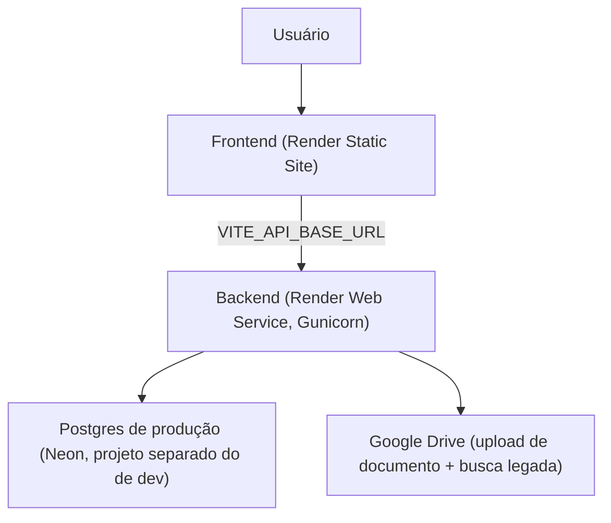

# HUB — Arquitetura (mapa de dependências)

> **Documentos relacionados:** [[VISAO]] · [[PROGRESS]] · [[API_CONTRACTS]] · [[DEPLOY]] · [[RATEIO]] · [[PENDENCIAS]] · [[CONTRIBUTING]] · [[README]]

Este arquivo existe pra dar contexto rápido (pra humano ou IA) de **quem chama quem** no backend, sem precisar abrir todos os arquivos. Atualize aqui sempre que criar um domínio novo (rota+service+model) — é mais rápido manter isso em dia do que reconstruir o raciocínio do zero numa sessão futura.

## Mapa por domínio


```mermaid
graph TD
  subgraph Auth["Autenticação"]
    AuthRoutes["auth_routes.py"] --> AuthService["auth_service.py"]
    AuthService --> UserModel["models/user.py"]
    OAuthRoutes["oauth_routes.py"] --> OAuthService["oauth_service.py"]
    OAuthService --> GoogleAccountModel["models/google_account.py"]
  end

  subgraph Clientes["Clientes"]
    ClientRoutes["client_routes.py"] --> ClientService["client_service.py"]
    ClientService --> ClientModel["models/client.py"]
    ClientService -.reaproveita.-> UcService
  end

  subgraph UCs["UCs"]
    UcRoutes["uc_routes.py"] --> UcService["uc_service.py"]
    UcService --> ConsumerUnitModel["models/consumer_unit.py"]
  end

  subgraph Usinas["Usinas"]
    PlantRoutes["plant_routes.py"] --> PlantService["plant_service.py"]
    PlantService --> PlantModel["models/plant.py"]
    PlantRoutes -.remove conexao.-> UcService
  end

  subgraph Rateio["Rateio"]
    RateioRoutes["rateio_routes.py"] --> RateioService["rateio_service.py"]
    RateioService --> PlantModel
    RateioService --> ConsumerUnitModel
    RateioService --> RateioHistoricoModel["models/rateio_historico.py"]
  end

  subgraph Documentos["Documentos"]
    DocumentRoutes["document_routes.py"] --> DocumentService["document_service.py"]
    DocumentService --> DriveService["drive_service.py"]
    DocumentService --> DocumentModel["models/document.py"]
  end

  subgraph Pendencias["Pendências"]
    PendenciaRoutes["pendencia_routes.py"] --> PendenciaService["pendencia_service.py"]
    PendenciaRoutes --> AutomacaoService["automacao_service.py"]
    PendenciaService --> PendenciaModel["models/pendencia.py"]
  end

  subgraph Identidade["Empresa / Usuários / Convites"]
    EmpresaRoutes["empresa_routes.py"] --> EmpresaService["empresa_service.py"]
    UserRoutes["user_routes.py"] --> UserService["user_service.py"]
    InvitationRoutes["invitation_routes.py"] --> InvitationService["invitation_service.py"]
    EmpresaService --> EmpresaModel["models/empresa.py"]
    UserService --> UserModel
  end

  TenantMixin["extensions.py — TenantMixin"] -.filtro automatico por empresa_id.-> ClientModel
  TenantMixin -.filtro automatico.-> ConsumerUnitModel
  TenantMixin -.filtro automatico.-> PlantModel
  TenantMixin -.filtro automatico.-> DocumentModel
  TenantMixin -.filtro automatico.-> PendenciaModel
```

## Boundary Plataforma × Empresa (PLATFORM-UI-1)

`PLATFORM CONTEXT != TENANT CONTEXT`.

O Platform Admin autentica normalmente, mas não herda acesso operacional à
empresa vinculada ao seu `User`. Sem `hub_platform_view` válido, o middleware
permite apenas as APIs administrativas sob `/api/v1/platform` e os endpoints de
identidade necessários; APIs tenant encerram a requisição com
`PLATFORM_TENANT_CONTEXT_REQUIRED` antes de qualquer consulta de domínio.
Uma allowlist por endpoint preserva as APIs globais legadas já protegidas por
Platform Admin (tarifas regulatórias, configuração de infraestrutura e as três
operações administrativas antigas de Empresa), sem liberar as rotas tenant de
Empresa ou qualquer outro domínio operacional.

O fluxo explícito é:

```text
Platform Admin → /platform → Entrar na empresa → Tenant Context
               → Sair da empresa → /platform
```

`POST /platform/empresas/<id>/entrar` valida `is_platform_admin` e a existência
da Empresa no backend, registra auditoria e grava apenas o ID no cookie
`HttpOnly` `hub_platform_view`. Em cada requisição, o middleware revalida o
usuário e resolve novamente a Empresa antes de definir `g.current_empresa_id`;
somente então o filtro estrutural de `TenantMixin` passa a operar naquele
tenant. `POST /platform/sair`, login e logout removem o cookie. O frontend não
persiste `empresa_id`: atualiza o contexto por `/auth/me`, recria as páginas e
invalida o cache de aparência por geração para impedir resposta tardia da
Empresa A de contaminar Platform ou Empresa B.

O Platform Shell reutiliza tokens e componentes do HUB, mas possui navegação
própria (`Visão geral` e `Empresas`). No Tenant Context administrativo, uma
faixa persistente identifica a empresa e oferece `Sair da empresa`.

## Fronteira ASAAS da plataforma (ARCH-PLATFORM-1)

`AsaasTransport` recebe URL-base e chave explicitamente e executa somente HTTP.
`AsaasClient(empresa_id)` mantém os consumidores B0–B3 e resolve `ApiCredential`
cifrada da empresa no ambiente tenant `ASAAS_API_BASE_URL`.
`PlatformAsaasService` usa apenas `PLATFORM_ASAAS_API_BASE_URL` e
`PLATFORM_ASAAS_API_KEY`, sem consultar tenant.

`POST /api/v1/webhooks/asaas` mantém lookup de Fatura, autenticação por token da
empresa e ledger `PaymentWebhookEvent`. A rota separada
`POST /api/v1/webhooks/asaas/platform` autentica token global antes de gravar
somente `PlatformAsaasWebhookEvent`. O ledger da plataforma registra recebimento,
sem conciliação ou efeito de cobrança SaaS. Referências tenant antigas
`hub-<uuid>` seguem válidas; referências de plataforma presentes no webhook
exigem `hub-platform-`.

E-mail transacional via Resend usa globalmente `RESEND_API_KEY` e `EMAIL_FROM`.
A credencial `resend` cadastrável por empresa na UI não substitui a chave global.

## PDFs de fatura em object storage (STORAGE-1)

`FaturaConcessionaria.document_id` é obrigatório. O `Document` vinculado guarda
`storage_provider` e `storage_ref`; não há segunda referência física na fatura.
`FaturaConcessionaria.arquivo_hash` continua o SHA-256 de deduplicação e
verificação do original. `object_storage.py` oferece `put/read/delete` com
chave, bytes e MIME, sem importar Fatura, Document, Cliente, UC ou Usina.
Novos PDFs usam chave opaca `tenants/<empresa_id>/invoices/<ano>/<mes>/<uuid>.pdf`
em S3/R2 privado (local apenas em desenvolvimento). `invoice_document_service.py`
verifica tenant, vínculo e hash e lê o provider gravado: S3, Drive ou local legado.
As rotas de download de fatura exigem `faturas.read` antes dessa leitura; a rota
admin exige empresa explícita. O backend entrega os bytes e nome sanitizado.
Documentos gerais ainda usam seu fluxo Drive atual; STORAGE-2 não começou.

## Onde procurar cada coisa

| Preciso mexer em... | Vou em... |
|---|---|
| Regra de negócio de Cliente/UC/Usina | `backend/services/*_service.py` |
| Validação de campo obrigatório numa rota | `backend/routes/*_routes.py` (validação de entrada) + o service (regra de fato) |
| Campo novo no banco | `backend/models/*.py` + migration em `backend/migrations/versions/` |
| Tela/formulário no frontend | `frontend/src/pages/` (tela) → `frontend/src/components/` (peça reutilizável) → `frontend/src/services/*Service.ts` (chamada HTTP) |
| Cálculo do rateio | `backend/services/rateio_service.py` (motor) — ver também [[RATEIO]] pra especificação de negócio |
| Multi-tenant / isolamento por empresa | `backend/extensions.py` (`TenantMixin`) — ver [[SPRINT_02]] |

## Convenção de nomenclatura (pra IA nova entender rápido)

- Termos de domínio ficam em português nos models/services (`rateio`, `usina`, `concessionária`) — ver seção "Key domain terminology" no histórico de memória do João, ou perguntar direto.
- `qualificado`/`qualificação` substituiu `elegível`/`elegibilidade` em todo o código — não reintroduzir o termo antigo.
```

---

## Mapa gerado automaticamente

A seção abaixo é escrita sozinha toda vez que você roda `python hub.py iniciar` — reflete os imports reais do código naquele momento. Não editar na mão (a próxima vez que o HUB iniciar, ela é sobrescrita).

<!-- MAPA-AUTO:INICIO -->
> Gerado automaticamente por `python hub.py iniciar` (`comandos/mapear.py`) -- nao editar esta secao na mao, a proxima execucao sobrescreve.

### Backend (imports reais entre routes / services / models / utils)

```mermaid
graph TD
  subgraph models["models"]
    models_agenda_event["models.agenda_event"]
    models_api_credential["models.api_credential"]
    models_assinatura["models.assinatura"]
    models_calculo_cobranca["models.calculo_cobranca"]
    models_category["models.category"]
    models_client["models.client"]
    models_consumer_unit["models.consumer_unit"]
    models_document["models.document"]
    models_drive_item["models.drive_item"]
    models_email_template["models.email_template"]
    models_empresa["models.empresa"]
    models_fatura["models.fatura"]
    models_fatura_concessionaria["models.fatura_concessionaria"]
    models_google_account["models.google_account"]
    models_grupo_regra_cobranca["models.grupo_regra_cobranca"]
    models_import_preview["models.import_preview"]
    models_invitation["models.invitation"]
    models_limite_contratado["models.limite_contratado"]
    models_log_entry["models.log_entry"]
    models_message_template["models.message_template"]
    models_password_reset_token["models.password_reset_token"]
    models_payment_webhook_event["models.payment_webhook_event"]
    models_pendencia["models.pendencia"]
    models_plant["models.plant"]
    models_platform_asaas_webhook_event["models.platform_asaas_webhook_event"]
    models_rateio_historico["models.rateio_historico"]
    models_regra_cobranca_assignment["models.regra_cobranca_assignment"]
    models_regulatory_tariff["models.regulatory_tariff"]
    models_setting["models.setting"]
    models_user["models.user"]
    models_whatsapp["models.whatsapp"]
  end
  subgraph raiz["raiz"]
    app["app"]
    config["config"]
    extensions["extensions"]
    security_middleware["security_middleware"]
  end
  subgraph routes["routes"]
    routes_agenda_routes["routes.agenda_routes"]
    routes_api_credential_routes["routes.api_credential_routes"]
    routes_auth_routes["routes.auth_routes"]
    routes_billing_calculation_routes["routes.billing_calculation_routes"]
    routes_billing_pdf_lab_routes["routes.billing_pdf_lab_routes"]
    routes_category_routes["routes.category_routes"]
    routes_client_routes["routes.client_routes"]
    routes_config_routes["routes.config_routes"]
    routes_dashboard_routes["routes.dashboard_routes"]
    routes_document_routes["routes.document_routes"]
    routes_drive_routes["routes.drive_routes"]
    routes_email_template_routes["routes.email_template_routes"]
    routes_empresa_routes["routes.empresa_routes"]
    routes_fatura_routes["routes.fatura_routes"]
    routes_grupo_regra_cobranca_routes["routes.grupo_regra_cobranca_routes"]
    routes_health_routes["routes.health_routes"]
    routes_import_routes["routes.import_routes"]
    routes_invitation_routes["routes.invitation_routes"]
    routes_log_routes["routes.log_routes"]
    routes_message_template_routes["routes.message_template_routes"]
    routes_oauth_routes["routes.oauth_routes"]
    routes_pendencia_routes["routes.pendencia_routes"]
    routes_plant_routes["routes.plant_routes"]
    routes_platform_routes["routes.platform_routes"]
    routes_rateio_routes["routes.rateio_routes"]
    routes_regra_cobranca_assignment_routes["routes.regra_cobranca_assignment_routes"]
    routes_regulatory_tariff_routes["routes.regulatory_tariff_routes"]
    routes_settings_routes["routes.settings_routes"]
    routes_uc_routes["routes.uc_routes"]
    routes_user_routes["routes.user_routes"]
    routes_whatsapp_routes["routes.whatsapp_routes"]
  end
  subgraph services["services"]
    services["services"]
    services_agenda_service["services.agenda_service"]
    services_aneel_ckan_client["services.aneel_ckan_client"]
    services_api_credential_service["services.api_credential_service"]
    services_asaas_client["services.asaas_client"]
    services_asaas_webhook_service["services.asaas_webhook_service"]
    services_auth_service["services.auth_service"]
    services_automacao_service["services.automacao_service"]
    services_billing_calculation_contracts["services.billing_calculation_contracts"]
    services_billing_calculation_engine["services.billing_calculation_engine"]
    services_billing_calculation_service["services.billing_calculation_service"]
    services_billing_pdf_lab_service["services.billing_pdf_lab_service"]
    services_billing_rule_resolver["services.billing_rule_resolver"]
    services_cad_identity["services.cad_identity"]
    services_client_service["services.client_service"]
    services_commercial_deduction_resolver["services.commercial_deduction_resolver"]
    services_commercial_tariff_selector["services.commercial_tariff_selector"]
    services_dashboard_service["services.dashboard_service"]
    services_database_config_service["services.database_config_service"]
    services_document_service["services.document_service"]
    services_document_tariff_resolver["services.document_tariff_resolver"]
    services_drive_service["services.drive_service"]
    services_email_service["services.email_service"]
    services_email_template_defaults["services.email_template_defaults"]
    services_email_template_service["services.email_template_service"]
    services_empresa_service["services.empresa_service"]
    services_fatura_concessionaria_upload_service["services.fatura_concessionaria_upload_service"]
    services_fatura_processing_service["services.fatura_processing_service"]
    services_fatura_service["services.fatura_service"]
    services_fio_b_resolver["services.fio_b_resolver"]
    services_gd_compensation_pending_service["services.gd_compensation_pending_service"]
    services_grupo_regra_cobranca_service["services.grupo_regra_cobranca_service"]
    services_import_service["services.import_service"]
    services_invitation_service["services.invitation_service"]
    services_invoice_compensation["services.invoice_compensation"]
    services_invoice_document_service["services.invoice_document_service"]
    services_invoice_normalization_service["services.invoice_normalization_service"]
    services_invoice_parsers_extraction["services.invoice_parsers.extraction"]
    services_invoice_parsers_registry["services.invoice_parsers.registry"]
    services_invoice_parsers_schemas["services.invoice_parsers.schemas"]
    services_invoice_validation_service["services.invoice_validation_service"]
    services_log_service["services.log_service"]
    services_message_template_service["services.message_template_service"]
    services_oauth_service["services.oauth_service"]
    services_object_storage["services.object_storage"]
    services_password_reset_service["services.password_reset_service"]
    services_pendencia_service["services.pendencia_service"]
    services_permission_service["services.permission_service"]
    services_plant_service["services.plant_service"]
    services_platform_asaas_webhook_service["services.platform_asaas_webhook_service"]
    services_quota_service["services.quota_service"]
    services_rateio_excel_service["services.rateio_excel_service"]
    services_rateio_formulario_service["services.rateio_formulario_service"]
    services_rateio_pdf_service["services.rateio_pdf_service"]
    services_rateio_service["services.rateio_service"]
    services_regra_cobranca_assignment_service["services.regra_cobranca_assignment_service"]
    services_regulatory_tariff_import_service["services.regulatory_tariff_import_service"]
    services_regulatory_tariff_repository["services.regulatory_tariff_repository"]
    services_settings_service["services.settings_service"]
    services_tariff_selector["services.tariff_selector"]
    services_uc_code["services.uc_code"]
    services_uc_discount["services.uc_discount"]
    services_uc_service["services.uc_service"]
    services_user_service["services.user_service"]
    services_whatsapp_service["services.whatsapp_service"]
  end
  subgraph utils["utils"]
    utils_api_response["utils.api_response"]
    utils_auth["utils.auth"]
    utils_crypto["utils.crypto"]
    utils_files["utils.files"]
  end
  app --> config
  app --> extensions
  app --> models_agenda_event
  app --> models_api_credential
  app --> models_assinatura
  app --> models_calculo_cobranca
  app --> models_category
  app --> models_client
  app --> models_consumer_unit
  app --> models_document
  app --> models_email_template
  app --> models_empresa
  app --> models_fatura
  app --> models_fatura_concessionaria
  app --> models_google_account
  app --> models_grupo_regra_cobranca
  app --> models_import_preview
  app --> models_invitation
  app --> models_limite_contratado
  app --> models_log_entry
  app --> models_message_template
  app --> models_password_reset_token
  app --> models_payment_webhook_event
  app --> models_pendencia
  app --> models_plant
  app --> models_platform_asaas_webhook_event
  app --> models_rateio_historico
  app --> models_regra_cobranca_assignment
  app --> models_regulatory_tariff
  app --> models_setting
  app --> models_user
  app --> models_whatsapp
  app --> routes_agenda_routes
  app --> routes_api_credential_routes
  app --> routes_auth_routes
  app --> routes_billing_calculation_routes
  app --> routes_billing_pdf_lab_routes
  app --> routes_category_routes
  app --> routes_client_routes
  app --> routes_config_routes
  app --> routes_dashboard_routes
  app --> routes_document_routes
  app --> routes_drive_routes
  app --> routes_email_template_routes
  app --> routes_empresa_routes
  app --> routes_fatura_routes
  app --> routes_grupo_regra_cobranca_routes
  app --> routes_health_routes
  app --> routes_import_routes
  app --> routes_invitation_routes
  app --> routes_log_routes
  app --> routes_message_template_routes
  app --> routes_oauth_routes
  app --> routes_pendencia_routes
  app --> routes_plant_routes
  app --> routes_platform_routes
  app --> routes_rateio_routes
  app --> routes_regra_cobranca_assignment_routes
  app --> routes_regulatory_tariff_routes
  app --> routes_settings_routes
  app --> routes_uc_routes
  app --> routes_user_routes
  app --> routes_whatsapp_routes
  app --> services_import_service
  app --> services_regulatory_tariff_import_service
  app --> utils_auth
  models_agenda_event --> extensions
  models_api_credential --> extensions
  models_api_credential --> utils_crypto
  models_assinatura --> extensions
  models_calculo_cobranca --> extensions
  models_calculo_cobranca --> services_invoice_normalization_service
  models_category --> extensions
  models_client --> extensions
  models_consumer_unit --> extensions
  models_document --> extensions
  models_email_template --> extensions
  models_empresa --> extensions
  models_fatura --> extensions
  models_fatura_concessionaria --> extensions
  models_google_account --> extensions
  models_google_account --> utils_crypto
  models_grupo_regra_cobranca --> extensions
  models_grupo_regra_cobranca --> services_billing_calculation_contracts
  models_import_preview --> extensions
  models_invitation --> extensions
  models_limite_contratado --> extensions
  models_log_entry --> extensions
  models_message_template --> extensions
  models_password_reset_token --> extensions
  models_payment_webhook_event --> extensions
  models_pendencia --> extensions
  models_plant --> extensions
  models_platform_asaas_webhook_event --> extensions
  models_rateio_historico --> extensions
  models_regra_cobranca_assignment --> extensions
  models_regra_cobranca_assignment --> services_billing_calculation_contracts
  models_regulatory_tariff --> extensions
  models_setting --> extensions
  models_user --> extensions
  models_whatsapp --> extensions
  routes_agenda_routes --> extensions
  routes_agenda_routes --> services_agenda_service
  routes_agenda_routes --> services_permission_service
  routes_agenda_routes --> utils_api_response
  routes_api_credential_routes --> extensions
  routes_api_credential_routes --> services_api_credential_service
  routes_api_credential_routes --> services_asaas_client
  routes_api_credential_routes --> services_permission_service
  routes_api_credential_routes --> utils_api_response
  routes_auth_routes --> extensions
  routes_auth_routes --> services_auth_service
  routes_auth_routes --> services_invitation_service
  routes_auth_routes --> services_password_reset_service
  routes_auth_routes --> services_user_service
  routes_auth_routes --> utils_api_response
  routes_auth_routes --> utils_auth
  routes_billing_calculation_routes --> extensions
  routes_billing_calculation_routes --> models_calculo_cobranca
  routes_billing_calculation_routes --> models_client
  routes_billing_calculation_routes --> models_consumer_unit
  routes_billing_calculation_routes --> models_empresa
  routes_billing_calculation_routes --> models_fatura
  routes_billing_calculation_routes --> models_fatura_concessionaria
  routes_billing_calculation_routes --> models_pendencia
  routes_billing_calculation_routes --> routes_client_routes
  routes_billing_calculation_routes --> services_billing_calculation_service
  routes_billing_calculation_routes --> services_invoice_document_service
  routes_billing_calculation_routes --> services_object_storage
  routes_billing_calculation_routes --> services_permission_service
  routes_billing_calculation_routes --> utils_api_response
  routes_billing_pdf_lab_routes --> services_billing_pdf_lab_service
  routes_billing_pdf_lab_routes --> services_fatura_concessionaria_upload_service
  routes_billing_pdf_lab_routes --> utils_api_response
  routes_category_routes --> extensions
  routes_category_routes --> models_category
  routes_category_routes --> services_permission_service
  routes_category_routes --> utils_api_response
  routes_client_routes --> services_client_service
  routes_client_routes --> services_fatura_concessionaria_upload_service
  routes_client_routes --> services_permission_service
  routes_client_routes --> utils_api_response
  routes_config_routes --> services_database_config_service
  routes_config_routes --> services_drive_service
  routes_config_routes --> services_permission_service
  routes_config_routes --> utils_api_response
  routes_dashboard_routes --> services_dashboard_service
  routes_dashboard_routes --> services_permission_service
  routes_dashboard_routes --> utils_api_response
  routes_document_routes --> models_fatura_concessionaria
  routes_document_routes --> services_document_service
  routes_document_routes --> services_permission_service
  routes_document_routes --> utils_api_response
  routes_drive_routes --> services_drive_service
  routes_drive_routes --> services_permission_service
  routes_drive_routes --> utils_api_response
  routes_email_template_routes --> extensions
  routes_email_template_routes --> services_email_service
  routes_email_template_routes --> services_email_template_service
  routes_email_template_routes --> services_log_service
  routes_email_template_routes --> services_permission_service
  routes_email_template_routes --> utils_api_response
  routes_empresa_routes --> config
  routes_empresa_routes --> models_empresa
  routes_empresa_routes --> models_user
  routes_empresa_routes --> services_empresa_service
  routes_empresa_routes --> services_permission_service
  routes_empresa_routes --> utils_api_response
  routes_fatura_routes --> services_asaas_client
  routes_fatura_routes --> services_asaas_webhook_service
  routes_fatura_routes --> services_fatura_service
  routes_fatura_routes --> services_permission_service
  routes_fatura_routes --> services_platform_asaas_webhook_service
  routes_fatura_routes --> utils_api_response
  routes_grupo_regra_cobranca_routes --> services
  routes_grupo_regra_cobranca_routes --> services_grupo_regra_cobranca_service
  routes_grupo_regra_cobranca_routes --> services_permission_service
  routes_grupo_regra_cobranca_routes --> utils_api_response
  routes_health_routes --> extensions
  routes_import_routes --> extensions
  routes_import_routes --> services_import_service
  routes_import_routes --> services_permission_service
  routes_import_routes --> utils_api_response
  routes_invitation_routes --> config
  routes_invitation_routes --> services_invitation_service
  routes_invitation_routes --> services_permission_service
  routes_invitation_routes --> utils_api_response
  routes_log_routes --> services_log_service
  routes_log_routes --> services_permission_service
  routes_log_routes --> utils_api_response
  routes_message_template_routes --> services
  routes_message_template_routes --> services_permission_service
  routes_message_template_routes --> utils_api_response
  routes_oauth_routes --> config
  routes_oauth_routes --> services_log_service
  routes_oauth_routes --> services_oauth_service
  routes_oauth_routes --> services_permission_service
  routes_oauth_routes --> utils_api_response
  routes_pendencia_routes --> extensions
  routes_pendencia_routes --> services_automacao_service
  routes_pendencia_routes --> services_pendencia_service
  routes_pendencia_routes --> services_permission_service
  routes_pendencia_routes --> utils_api_response
  routes_plant_routes --> services_permission_service
  routes_plant_routes --> services_plant_service
  routes_plant_routes --> services_uc_service
  routes_plant_routes --> utils_api_response
  routes_platform_routes --> extensions
  routes_platform_routes --> models_empresa
  routes_platform_routes --> models_user
  routes_platform_routes --> services_log_service
  routes_platform_routes --> services_permission_service
  routes_platform_routes --> utils_api_response
  routes_platform_routes --> utils_auth
  routes_rateio_routes --> services_permission_service
  routes_rateio_routes --> services_rateio_excel_service
  routes_rateio_routes --> services_rateio_formulario_service
  routes_rateio_routes --> services_rateio_pdf_service
  routes_rateio_routes --> services_rateio_service
  routes_rateio_routes --> utils_api_response
  routes_regra_cobranca_assignment_routes --> services
  routes_regra_cobranca_assignment_routes --> services_permission_service
  routes_regra_cobranca_assignment_routes --> services_regra_cobranca_assignment_service
  routes_regra_cobranca_assignment_routes --> utils_api_response
  routes_regulatory_tariff_routes --> config
  routes_regulatory_tariff_routes --> extensions
  routes_regulatory_tariff_routes --> services_aneel_ckan_client
  routes_regulatory_tariff_routes --> services_log_service
  routes_regulatory_tariff_routes --> services_permission_service
  routes_regulatory_tariff_routes --> services_regulatory_tariff_import_service
  routes_regulatory_tariff_routes --> utils_api_response
  routes_settings_routes --> services_drive_service
  routes_settings_routes --> services_permission_service
  routes_settings_routes --> services_settings_service
  routes_settings_routes --> utils_api_response
  routes_uc_routes --> services_permission_service
  routes_uc_routes --> services_uc_service
  routes_uc_routes --> utils_api_response
  routes_user_routes --> services_permission_service
  routes_user_routes --> services_user_service
  routes_user_routes --> utils_api_response
  routes_whatsapp_routes --> extensions
  routes_whatsapp_routes --> services
  routes_whatsapp_routes --> services_permission_service
  routes_whatsapp_routes --> utils_api_response
  security_middleware --> extensions
  security_middleware --> services_log_service
  security_middleware --> utils_api_response
  services_agenda_service --> extensions
  services_agenda_service --> models_agenda_event
  services_agenda_service --> models_pendencia
  services_agenda_service --> services_log_service
  services_api_credential_service --> extensions
  services_api_credential_service --> models_api_credential
  services_api_credential_service --> models_log_entry
  services_api_credential_service --> services_asaas_client
  services_api_credential_service --> services_log_service
  services_api_credential_service --> utils_crypto
  services_asaas_client --> config
  services_asaas_client --> models_api_credential
  services_asaas_webhook_service --> extensions
  services_asaas_webhook_service --> models_api_credential
  services_asaas_webhook_service --> models_fatura
  services_asaas_webhook_service --> models_payment_webhook_event
  services_asaas_webhook_service --> services_asaas_client
  services_asaas_webhook_service --> utils_crypto
  services_auth_service --> extensions
  services_auth_service --> models_empresa
  services_auth_service --> models_user
  services_auth_service --> services_log_service
  services_auth_service --> utils_auth
  services_automacao_service --> extensions
  services_automacao_service --> models_client
  services_automacao_service --> models_consumer_unit
  services_automacao_service --> models_document
  services_automacao_service --> models_pendencia
  services_automacao_service --> services_log_service
  services_automacao_service --> services_pendencia_service
  services_billing_calculation_contracts --> services_invoice_compensation
  services_billing_calculation_contracts --> services_invoice_normalization_service
  services_billing_calculation_engine --> services_billing_calculation_contracts
  services_billing_calculation_engine --> services_commercial_deduction_resolver
  services_billing_calculation_engine --> services_commercial_tariff_selector
  services_billing_calculation_engine --> services_document_tariff_resolver
  services_billing_calculation_engine --> services_fio_b_resolver
  services_billing_calculation_engine --> services_invoice_compensation
  services_billing_calculation_engine --> services_invoice_normalization_service
  services_billing_calculation_service --> extensions
  services_billing_calculation_service --> models_calculo_cobranca
  services_billing_calculation_service --> models_consumer_unit
  services_billing_calculation_service --> models_fatura_concessionaria
  services_billing_calculation_service --> services_billing_calculation_contracts
  services_billing_calculation_service --> services_billing_calculation_engine
  services_billing_calculation_service --> services_billing_rule_resolver
  services_billing_calculation_service --> services_commercial_tariff_selector
  services_billing_calculation_service --> services_document_tariff_resolver
  services_billing_calculation_service --> services_invoice_compensation
  services_billing_calculation_service --> services_invoice_normalization_service
  services_billing_calculation_service --> services_invoice_parsers_schemas
  services_billing_calculation_service --> services_invoice_validation_service
  services_billing_calculation_service --> services_regulatory_tariff_repository
  services_billing_calculation_service --> services_uc_code
  services_billing_calculation_service --> services_uc_discount
  services_billing_pdf_lab_service --> services_billing_calculation_service
  services_billing_pdf_lab_service --> services_invoice_compensation
  services_billing_pdf_lab_service --> services_invoice_normalization_service
  services_billing_pdf_lab_service --> services_invoice_parsers_extraction
  services_billing_pdf_lab_service --> services_invoice_parsers_registry
  services_billing_rule_resolver --> extensions
  services_billing_rule_resolver --> models_client
  services_billing_rule_resolver --> models_consumer_unit
  services_billing_rule_resolver --> services_billing_calculation_contracts
  services_billing_rule_resolver --> services_grupo_regra_cobranca_service
  services_billing_rule_resolver --> services_regra_cobranca_assignment_service
  services_client_service --> extensions
  services_client_service --> models_client
  services_client_service --> models_consumer_unit
  services_client_service --> services_cad_identity
  services_client_service --> services_uc_service
  services_commercial_deduction_resolver --> services_billing_calculation_contracts
  services_commercial_deduction_resolver --> services_fio_b_resolver
  services_commercial_deduction_resolver --> services_invoice_compensation
  services_commercial_deduction_resolver --> services_invoice_normalization_service
  services_commercial_deduction_resolver --> services_invoice_parsers_schemas
  services_commercial_tariff_selector --> services_billing_calculation_contracts
  services_commercial_tariff_selector --> services_document_tariff_resolver
  services_commercial_tariff_selector --> services_invoice_normalization_service
  services_dashboard_service --> extensions
  services_dashboard_service --> models_client
  services_dashboard_service --> models_consumer_unit
  services_dashboard_service --> models_document
  services_dashboard_service --> models_pendencia
  services_dashboard_service --> models_plant
  services_dashboard_service --> services_permission_service
  services_document_service --> extensions
  services_document_service --> models_category
  services_document_service --> models_client
  services_document_service --> models_consumer_unit
  services_document_service --> models_document
  services_document_service --> services_drive_service
  services_document_service --> services_log_service
  services_document_tariff_resolver --> services_invoice_compensation
  services_document_tariff_resolver --> services_invoice_normalization_service
  services_document_tariff_resolver --> services_invoice_parsers_schemas
  services_drive_service --> config
  services_drive_service --> models_empresa
  services_drive_service --> models_google_account
  services_drive_service --> models_setting
  services_drive_service --> services_database_config_service
  services_drive_service --> services_log_service
  services_drive_service --> utils_files
  services_email_service --> config
  services_email_service --> services_log_service
  services_email_template_service --> extensions
  services_email_template_service --> models_email_template
  services_email_template_service --> services_email_template_defaults
  services_email_template_service --> services_log_service
  services_email_template_service --> services_message_template_service
  services_empresa_service --> extensions
  services_empresa_service --> models_empresa
  services_empresa_service --> models_user
  services_empresa_service --> services_document_service
  services_empresa_service --> services_email_template_service
  services_empresa_service --> services_log_service
  services_empresa_service --> services_message_template_service
  services_empresa_service --> utils_auth
  services_fatura_concessionaria_upload_service --> extensions
  services_fatura_concessionaria_upload_service --> models_client
  services_fatura_concessionaria_upload_service --> models_consumer_unit
  services_fatura_concessionaria_upload_service --> models_document
  services_fatura_concessionaria_upload_service --> models_fatura_concessionaria
  services_fatura_concessionaria_upload_service --> services_invoice_parsers_extraction
  services_fatura_concessionaria_upload_service --> services_invoice_parsers_registry
  services_fatura_concessionaria_upload_service --> services_object_storage
  services_fatura_concessionaria_upload_service --> services_uc_code
  services_fatura_processing_service --> extensions
  services_fatura_processing_service --> models_client
  services_fatura_processing_service --> models_consumer_unit
  services_fatura_processing_service --> models_document
  services_fatura_processing_service --> models_empresa
  services_fatura_processing_service --> models_fatura_concessionaria
  services_fatura_processing_service --> services_gd_compensation_pending_service
  services_fatura_processing_service --> services_invoice_normalization_service
  services_fatura_processing_service --> services_invoice_parsers_extraction
  services_fatura_processing_service --> services_invoice_parsers_registry
  services_fatura_processing_service --> services_invoice_parsers_schemas
  services_fatura_processing_service --> services_invoice_validation_service
  services_fatura_processing_service --> services_uc_code
  services_fatura_service --> extensions
  services_fatura_service --> models_client
  services_fatura_service --> models_consumer_unit
  services_fatura_service --> models_fatura
  services_fatura_service --> models_user
  services_fatura_service --> services_asaas_client
  services_fatura_service --> services_log_service
  services_fatura_service --> services_permission_service
  services_fio_b_resolver --> services_invoice_compensation
  services_fio_b_resolver --> services_invoice_normalization_service
  services_fio_b_resolver --> services_invoice_parsers_schemas
  services_fio_b_resolver --> services_regulatory_tariff_repository
  services_gd_compensation_pending_service --> extensions
  services_gd_compensation_pending_service --> models_consumer_unit
  services_gd_compensation_pending_service --> models_fatura_concessionaria
  services_gd_compensation_pending_service --> models_pendencia
  services_gd_compensation_pending_service --> models_plant
  services_gd_compensation_pending_service --> services_log_service
  services_grupo_regra_cobranca_service --> extensions
  services_grupo_regra_cobranca_service --> models_grupo_regra_cobranca
  services_grupo_regra_cobranca_service --> models_regra_cobranca_assignment
  services_grupo_regra_cobranca_service --> services_billing_calculation_contracts
  services_import_service --> extensions
  services_import_service --> models_client
  services_import_service --> models_consumer_unit
  services_import_service --> models_import_preview
  services_import_service --> models_log_entry
  services_import_service --> models_plant
  services_import_service --> services_cad_identity
  services_import_service --> services_uc_code
  services_import_service --> services_uc_discount
  services_invitation_service --> config
  services_invitation_service --> extensions
  services_invitation_service --> models_empresa
  services_invitation_service --> models_invitation
  services_invitation_service --> models_user
  services_invitation_service --> services_email_service
  services_invitation_service --> services_email_template_service
  services_invitation_service --> services_log_service
  services_invitation_service --> services_user_service
  services_invitation_service --> utils_auth
  services_invoice_compensation --> services_invoice_parsers_schemas
  services_invoice_document_service --> models_client
  services_invoice_document_service --> models_document
  services_invoice_document_service --> models_fatura_concessionaria
  services_invoice_document_service --> services_document_service
  services_invoice_document_service --> services_object_storage
  services_invoice_normalization_service --> services_invoice_compensation
  services_invoice_normalization_service --> services_invoice_parsers_schemas
  services_invoice_normalization_service --> services_uc_code
  services_invoice_validation_service --> services_invoice_parsers_schemas
  services_log_service --> extensions
  services_log_service --> models_log_entry
  services_message_template_service --> extensions
  services_message_template_service --> models_email_template
  services_message_template_service --> models_log_entry
  services_message_template_service --> models_message_template
  services_message_template_service --> services_email_template_service
  services_oauth_service --> config
  services_oauth_service --> extensions
  services_oauth_service --> models_google_account
  services_oauth_service --> models_setting
  services_oauth_service --> services_drive_service
  services_oauth_service --> services_log_service
  services_object_storage --> services_drive_service
  services_password_reset_service --> config
  services_password_reset_service --> extensions
  services_password_reset_service --> models_password_reset_token
  services_password_reset_service --> models_user
  services_password_reset_service --> services_email_service
  services_password_reset_service --> services_email_template_service
  services_password_reset_service --> services_log_service
  services_password_reset_service --> utils_auth
  services_pendencia_service --> extensions
  services_pendencia_service --> models_client
  services_pendencia_service --> models_consumer_unit
  services_pendencia_service --> models_document
  services_pendencia_service --> models_pendencia
  services_pendencia_service --> models_plant
  services_pendencia_service --> models_user
  services_pendencia_service --> services_log_service
  services_permission_service --> services_quota_service
  services_permission_service --> utils_api_response
  services_plant_service --> extensions
  services_plant_service --> models_plant
  services_platform_asaas_webhook_service --> config
  services_platform_asaas_webhook_service --> extensions
  services_platform_asaas_webhook_service --> models_platform_asaas_webhook_event
  services_platform_asaas_webhook_service --> services_asaas_webhook_service
  services_quota_service --> models_assinatura
  services_quota_service --> models_client
  services_quota_service --> models_consumer_unit
  services_quota_service --> models_limite_contratado
  services_quota_service --> models_plant
  services_quota_service --> models_user
  services_rateio_excel_service --> models_empresa
  services_rateio_excel_service --> services_rateio_formulario_service
  services_rateio_formulario_service --> extensions
  services_rateio_formulario_service --> models_consumer_unit
  services_rateio_formulario_service --> models_document
  services_rateio_formulario_service --> models_empresa
  services_rateio_formulario_service --> models_pendencia
  services_rateio_formulario_service --> models_plant
  services_rateio_formulario_service --> models_setting
  services_rateio_formulario_service --> services_pendencia_service
  services_rateio_pdf_service --> services_drive_service
  services_rateio_pdf_service --> services_rateio_formulario_service
  services_rateio_service --> extensions
  services_rateio_service --> models_consumer_unit
  services_rateio_service --> models_plant
  services_rateio_service --> models_rateio_historico
  services_rateio_service --> services_log_service
  services_rateio_service --> services_settings_service
  services_regra_cobranca_assignment_service --> extensions
  services_regra_cobranca_assignment_service --> models_client
  services_regra_cobranca_assignment_service --> models_consumer_unit
  services_regra_cobranca_assignment_service --> models_grupo_regra_cobranca
  services_regra_cobranca_assignment_service --> models_regra_cobranca_assignment
  services_regra_cobranca_assignment_service --> services_billing_calculation_contracts
  services_regulatory_tariff_import_service --> config
  services_regulatory_tariff_import_service --> extensions
  services_regulatory_tariff_import_service --> models_regulatory_tariff
  services_regulatory_tariff_import_service --> services_aneel_ckan_client
  services_regulatory_tariff_repository --> models_regulatory_tariff
  services_regulatory_tariff_repository --> services_fio_b_resolver
  services_settings_service --> extensions
  services_settings_service --> models_setting
  services_tariff_selector --> services_billing_calculation_contracts
  services_tariff_selector --> services_document_tariff_resolver
  services_tariff_selector --> services_invoice_normalization_service
  services_uc_code --> models_client
  services_uc_code --> models_consumer_unit
  services_uc_service --> extensions
  services_uc_service --> models_api_credential
  services_uc_service --> models_client
  services_uc_service --> models_consumer_unit
  services_uc_service --> models_plant
  services_uc_service --> services_cad_identity
  services_uc_service --> services_log_service
  services_uc_service --> services_uc_code
  services_uc_service --> services_uc_discount
  services_user_service --> config
  services_user_service --> extensions
  services_user_service --> models_user
  services_user_service --> services_log_service
  services_user_service --> utils_auth
  services_whatsapp_service --> config
  services_whatsapp_service --> extensions
  services_whatsapp_service --> models_api_credential
  services_whatsapp_service --> models_client
  services_whatsapp_service --> models_consumer_unit
  services_whatsapp_service --> models_message_template
  services_whatsapp_service --> models_whatsapp
  utils_auth --> config
  utils_auth --> extensions
  utils_auth --> models_empresa
  utils_auth --> models_user
  utils_auth --> utils_api_response
  utils_crypto --> config
```

### Frontend (imports reais entre pages / components / services / hooks / layouts)

```mermaid
graph TD
  subgraph components["components"]
    components_BillingDiagnosticsPanel["components/BillingDiagnosticsPanel"]
    components_CategoryPicker["components/CategoryPicker"]
    components_ClientCard["components/ClientCard"]
    components_ClientDetailView["components/ClientDetailView"]
    components_ClientDocumentsPanel["components/ClientDocumentsPanel"]
    components_CommandPalette["components/CommandPalette"]
    components_ConcessionariaInvoicesPanel["components/ConcessionariaInvoicesPanel"]
    components_ConcessionariaPasswordField["components/ConcessionariaPasswordField"]
    components_ContextHelp["components/ContextHelp"]
    components_DashboardCards["components/DashboardCards"]
    components_DataTable["components/DataTable"]
    components_DetailDrawer["components/DetailDrawer"]
    components_DetailHeader["components/DetailHeader"]
    components_DocumentLinkModal["components/DocumentLinkModal"]
    components_ErrorBoundary["components/ErrorBoundary"]
    components_FaturasUi["components/FaturasUi"]
    components_Header["components/Header"]
    components_Icon["components/Icon"]
    components_IconStatCard["components/IconStatCard"]
    components_ImportacoesModal["components/ImportacoesModal"]
    components_IntegrationCard["components/IntegrationCard"]
    components_Loading["components/Loading"]
    components_Modal["components/Modal"]
    components_PlantCard["components/PlantCard"]
    components_PlantConnectionsField["components/PlantConnectionsField"]
    components_PlantDistribuicaoModal["components/PlantDistribuicaoModal"]
    components_RegulatoryTariffModal["components/RegulatoryTariffModal"]
    components_ReservedPanel["components/ReservedPanel"]
    components_ResultsList["components/ResultsList"]
    components_SearchPanel["components/SearchPanel"]
    components_Sidebar["components/Sidebar"]
    components_StatusBadge["components/StatusBadge"]
    components_Toast["components/Toast"]
    components_Tooltip["components/Tooltip"]
    components_UcBillingRuleSection["components/UcBillingRuleSection"]
    components_UcCard["components/UcCard"]
    components_UiState["components/UiState"]
    components_cadastroFields["components/cadastroFields"]
    components_formFields["components/formFields"]
  end
  subgraph hooks["hooks"]
    hooks_useGlobalLoading["hooks/useGlobalLoading"]
    hooks_useToast["hooks/useToast"]
  end
  subgraph layouts["layouts"]
    layouts_BaseLayout["layouts/BaseLayout"]
    layouts_PlatformLayout["layouts/PlatformLayout"]
  end
  subgraph pages["pages"]
    pages_AgendaPage["pages/AgendaPage"]
    pages_BillingRuleEditorPage["pages/BillingRuleEditorPage"]
    pages_BillingRulesPage["pages/BillingRulesPage"]
    pages_ChangePasswordPage["pages/ChangePasswordPage"]
    pages_ClientsPage["pages/ClientsPage"]
    pages_DashboardPage["pages/DashboardPage"]
    pages_DocumentsPage["pages/DocumentsPage"]
    pages_EmpresasPage["pages/EmpresasPage"]
    pages_FaturasPage["pages/FaturasPage"]
    pages_ForgotPasswordPage["pages/ForgotPasswordPage"]
    pages_ImportacoesPage["pages/ImportacoesPage"]
    pages_LoginPage["pages/LoginPage"]
    pages_MessagesPage["pages/MessagesPage"]
    pages_PendenciasPage["pages/PendenciasPage"]
    pages_PlaceholderPage["pages/PlaceholderPage"]
    pages_PlantsPage["pages/PlantsPage"]
    pages_PlatformCompaniesPage["pages/PlatformCompaniesPage"]
    pages_PlatformOverviewPage["pages/PlatformOverviewPage"]
    pages_RateioPage["pages/RateioPage"]
    pages_ResetPasswordPage["pages/ResetPasswordPage"]
    pages_SettingsPage["pages/SettingsPage"]
    pages_TemplatesPage["pages/TemplatesPage"]
    pages_UcsPage["pages/UcsPage"]
    pages_UsersPage["pages/UsersPage"]
    pages_faturasInvoiceDetail["pages/faturasInvoiceDetail"]
    pages_rateio_RateioFormularioView["pages/rateio/RateioFormularioView"]
    pages_rateio_RateioWizard["pages/rateio/RateioWizard"]
    pages_settingsActions["pages/settingsActions"]
    pages_settingsAppearance["pages/settingsAppearance"]
    pages_settingsDatabase["pages/settingsDatabase"]
    pages_settingsGeneral["pages/settingsGeneral"]
    pages_settingsIntegrations["pages/settingsIntegrations"]
    pages_settingsLogs["pages/settingsLogs"]
    pages_settingsShared["pages/settingsShared"]
  end
  subgraph services["services"]
    services_agendaService["services/agendaService"]
    services_apiClient["services/apiClient"]
    services_apiCredentialsService["services/apiCredentialsService"]
    services_authService["services/authService"]
    services_billingCalculationsService["services/billingCalculationsService"]
    services_billingDiagnosticsService["services/billingDiagnosticsService"]
    services_billingRulesService["services/billingRulesService"]
    services_clientsService["services/clientsService"]
    services_colorUtils["services/colorUtils"]
    services_config["services/config"]
    services_dashboardService["services/dashboardService"]
    services_databaseConfigService["services/databaseConfigService"]
    services_documentRules["services/documentRules"]
    services_documentsService["services/documentsService"]
    services_driveService["services/driveService"]
    services_emailTemplatesService["services/emailTemplatesService"]
    services_empresaService["services/empresaService"]
    services_faturasService["services/faturasService"]
    services_googleAccountService["services/googleAccountService"]
    services_importacoesService["services/importacoesService"]
    services_invitationService["services/invitationService"]
    services_listState["services/listState"]
    services_logsService["services/logsService"]
    services_messageTemplatesService["services/messageTemplatesService"]
    services_passwordResetService["services/passwordResetService"]
    services_pendenciaCategoriasService["services/pendenciaCategoriasService"]
    services_pendenciasService["services/pendenciasService"]
    services_plantService["services/plantService"]
    services_platformService["services/platformService"]
    services_rateioConfigService["services/rateioConfigService"]
    services_rateioFormularioService["services/rateioFormularioService"]
    services_rateioService["services/rateioService"]
    services_regulatoryTariffsService["services/regulatoryTariffsService"]
    services_router["services/router"]
    services_settingsService["services/settingsService"]
    services_themeService["services/themeService"]
    services_ucsService["services/ucsService"]
    services_userService["services/userService"]
    services_whatsappService["services/whatsappService"]
  end
  components_BillingDiagnosticsPanel --> hooks_useToast
  components_BillingDiagnosticsPanel --> services_billingDiagnosticsService
  components_CategoryPicker --> services_documentsService
  components_ClientCard --> components_ClientDocumentsPanel
  components_ClientCard --> components_ConcessionariaPasswordField
  components_ClientCard --> components_ContextHelp
  components_ClientCard --> components_PlantConnectionsField
  components_ClientCard --> components_cadastroFields
  components_ClientCard --> components_formFields
  components_ClientCard --> services_clientsService
  components_ClientCard --> services_plantService
  components_ClientDetailView --> services_clientsService
  components_ClientDocumentsPanel --> components_Icon
  components_ClientDocumentsPanel --> hooks_useToast
  components_ClientDocumentsPanel --> services_documentsService
  components_CommandPalette --> components_Icon
  components_CommandPalette --> services_authService
  components_ConcessionariaInvoicesPanel --> components_DataTable
  components_ConcessionariaInvoicesPanel --> components_Icon
  components_ConcessionariaInvoicesPanel --> hooks_useToast
  components_ConcessionariaInvoicesPanel --> services_authService
  components_ConcessionariaInvoicesPanel --> services_billingCalculationsService
  components_ConcessionariaInvoicesPanel --> services_clientsService
  components_ConcessionariaPasswordField --> components_formFields
  components_ConcessionariaPasswordField --> hooks_useToast
  components_ConcessionariaPasswordField --> services_authService
  components_ConcessionariaPasswordField --> services_ucsService
  components_DashboardCards --> components_Icon
  components_DataTable --> components_StatusBadge
  components_DataTable --> components_UiState
  components_DocumentLinkModal --> components_CategoryPicker
  components_DocumentLinkModal --> services_clientsService
  components_DocumentLinkModal --> services_documentsService
  components_ErrorBoundary --> components_Toast
  components_FaturasUi --> components_Modal
  components_FaturasUi --> components_StatusBadge
  components_FaturasUi --> services_faturasService
  components_IconStatCard --> components_Icon
  components_ImportacoesModal --> components_Icon
  components_ImportacoesModal --> pages_ImportacoesPage
  components_IntegrationCard --> components_Icon
  components_PlantCard --> components_formFields
  components_PlantCard --> services_plantService
  components_PlantConnectionsField --> services_clientsService
  components_PlantConnectionsField --> services_plantService
  components_PlantDistribuicaoModal --> services_plantService
  components_PlantDistribuicaoModal --> services_rateioService
  components_RegulatoryTariffModal --> services_regulatoryTariffsService
  components_ReservedPanel --> components_Icon
  components_ReservedPanel --> services_documentRules
  components_ResultsList --> services_documentRules
  components_Sidebar --> components_Icon
  components_Sidebar --> services_authService
  components_Sidebar --> services_settingsService
  components_UcBillingRuleSection --> components_ContextHelp
  components_UcBillingRuleSection --> hooks_useToast
  components_UcBillingRuleSection --> services_authService
  components_UcBillingRuleSection --> services_billingRulesService
  components_UcBillingRuleSection --> services_ucsService
  components_UcCard --> components_ConcessionariaPasswordField
  components_UcCard --> components_ContextHelp
  components_UcCard --> components_PlantConnectionsField
  components_UcCard --> components_cadastroFields
  components_UcCard --> components_formFields
  components_UcCard --> services_clientsService
  components_UcCard --> services_plantService
  components_UcCard --> services_ucsService
  hooks_useGlobalLoading --> components_Loading
  hooks_useToast --> components_Toast
  layouts_BaseLayout --> components_CommandPalette
  layouts_BaseLayout --> components_Header
  layouts_BaseLayout --> components_Icon
  layouts_BaseLayout --> components_Loading
  layouts_BaseLayout --> components_Sidebar
  layouts_BaseLayout --> components_Toast
  layouts_BaseLayout --> services_authService
  layouts_BaseLayout --> services_platformService
  layouts_BaseLayout --> services_settingsService
  layouts_PlatformLayout --> components_Header
  layouts_PlatformLayout --> components_Icon
  layouts_PlatformLayout --> components_Loading
  layouts_PlatformLayout --> components_Toast
  layouts_PlatformLayout --> services_authService
  pages_AgendaPage --> components_Icon
  pages_AgendaPage --> hooks_useGlobalLoading
  pages_AgendaPage --> hooks_useToast
  pages_AgendaPage --> layouts_BaseLayout
  pages_AgendaPage --> services_agendaService
  pages_AgendaPage --> services_pendenciasService
  pages_BillingRuleEditorPage --> components_ContextHelp
  pages_BillingRuleEditorPage --> components_formFields
  pages_BillingRuleEditorPage --> hooks_useGlobalLoading
  pages_BillingRuleEditorPage --> hooks_useToast
  pages_BillingRuleEditorPage --> layouts_BaseLayout
  pages_BillingRuleEditorPage --> services_authService
  pages_BillingRuleEditorPage --> services_billingRulesService
  pages_BillingRulesPage --> components_ContextHelp
  pages_BillingRulesPage --> components_DataTable
  pages_BillingRulesPage --> components_Icon
  pages_BillingRulesPage --> hooks_useGlobalLoading
  pages_BillingRulesPage --> hooks_useToast
  pages_BillingRulesPage --> layouts_BaseLayout
  pages_BillingRulesPage --> services_authService
  pages_BillingRulesPage --> services_billingRulesService
  pages_ChangePasswordPage --> components_Icon
  pages_ChangePasswordPage --> services_authService
  pages_ClientsPage --> components_ClientCard
  pages_ClientsPage --> components_ClientDetailView
  pages_ClientsPage --> components_ClientDocumentsPanel
  pages_ClientsPage --> components_DashboardCards
  pages_ClientsPage --> components_DataTable
  pages_ClientsPage --> components_DetailDrawer
  pages_ClientsPage --> components_ImportacoesModal
  pages_ClientsPage --> hooks_useGlobalLoading
  pages_ClientsPage --> hooks_useToast
  pages_ClientsPage --> layouts_BaseLayout
  pages_ClientsPage --> services_clientsService
  pages_ClientsPage --> services_listState
  pages_ClientsPage --> services_plantService
  pages_DashboardPage --> components_Icon
  pages_DashboardPage --> components_IconStatCard
  pages_DashboardPage --> components_UiState
  pages_DashboardPage --> hooks_useGlobalLoading
  pages_DashboardPage --> layouts_BaseLayout
  pages_DashboardPage --> services_dashboardService
  pages_DashboardPage --> services_pendenciasService
  pages_DocumentsPage --> components_DocumentLinkModal
  pages_DocumentsPage --> components_IconStatCard
  pages_DocumentsPage --> components_ReservedPanel
  pages_DocumentsPage --> components_ResultsList
  pages_DocumentsPage --> components_SearchPanel
  pages_DocumentsPage --> hooks_useGlobalLoading
  pages_DocumentsPage --> hooks_useToast
  pages_DocumentsPage --> layouts_BaseLayout
  pages_DocumentsPage --> services_clientsService
  pages_DocumentsPage --> services_documentRules
  pages_DocumentsPage --> services_documentsService
  pages_DocumentsPage --> services_driveService
  pages_EmpresasPage --> components_DataTable
  pages_EmpresasPage --> components_Icon
  pages_EmpresasPage --> components_IconStatCard
  pages_EmpresasPage --> components_formFields
  pages_EmpresasPage --> hooks_useGlobalLoading
  pages_EmpresasPage --> hooks_useToast
  pages_EmpresasPage --> layouts_BaseLayout
  pages_EmpresasPage --> services_authService
  pages_EmpresasPage --> services_dashboardService
  pages_EmpresasPage --> services_empresaService
  pages_EmpresasPage --> services_platformService
  pages_FaturasPage --> components_ConcessionariaInvoicesPanel
  pages_FaturasPage --> components_DataTable
  pages_FaturasPage --> components_FaturasUi
  pages_FaturasPage --> components_Icon
  pages_FaturasPage --> components_IconStatCard
  pages_FaturasPage --> components_Tooltip
  pages_FaturasPage --> hooks_useGlobalLoading
  pages_FaturasPage --> hooks_useToast
  pages_FaturasPage --> layouts_BaseLayout
  pages_FaturasPage --> pages_faturasInvoiceDetail
  pages_FaturasPage --> services_authService
  pages_FaturasPage --> services_billingCalculationsService
  pages_FaturasPage --> services_clientsService
  pages_FaturasPage --> services_faturasService
  pages_FaturasPage --> services_listState
  pages_FaturasPage --> services_pendenciasService
  pages_FaturasPage --> services_ucsService
  pages_ForgotPasswordPage --> components_Icon
  pages_ForgotPasswordPage --> services_passwordResetService
  pages_ImportacoesPage --> components_DataTable
  pages_ImportacoesPage --> components_Icon
  pages_ImportacoesPage --> hooks_useGlobalLoading
  pages_ImportacoesPage --> hooks_useToast
  pages_ImportacoesPage --> layouts_BaseLayout
  pages_ImportacoesPage --> services_authService
  pages_ImportacoesPage --> services_config
  pages_ImportacoesPage --> services_importacoesService
  pages_LoginPage --> components_Icon
  pages_LoginPage --> components_Sidebar
  pages_LoginPage --> services_authService
  pages_LoginPage --> services_config
  pages_MessagesPage --> hooks_useGlobalLoading
  pages_MessagesPage --> hooks_useToast
  pages_MessagesPage --> layouts_BaseLayout
  pages_MessagesPage --> services_authService
  pages_MessagesPage --> services_clientsService
  pages_MessagesPage --> services_whatsappService
  pages_PendenciasPage --> components_ClientDetailView
  pages_PendenciasPage --> components_DataTable
  pages_PendenciasPage --> components_Icon
  pages_PendenciasPage --> components_IconStatCard
  pages_PendenciasPage --> components_StatusBadge
  pages_PendenciasPage --> components_formFields
  pages_PendenciasPage --> hooks_useGlobalLoading
  pages_PendenciasPage --> hooks_useToast
  pages_PendenciasPage --> layouts_BaseLayout
  pages_PendenciasPage --> services_clientsService
  pages_PendenciasPage --> services_listState
  pages_PendenciasPage --> services_logsService
  pages_PendenciasPage --> services_pendenciaCategoriasService
  pages_PendenciasPage --> services_pendenciasService
  pages_PendenciasPage --> services_plantService
  pages_PendenciasPage --> services_ucsService
  pages_PlaceholderPage --> layouts_BaseLayout
  pages_PlantsPage --> components_ClientDetailView
  pages_PlantsPage --> components_DataTable
  pages_PlantsPage --> components_Icon
  pages_PlantsPage --> components_IconStatCard
  pages_PlantsPage --> components_ImportacoesModal
  pages_PlantsPage --> components_PlantCard
  pages_PlantsPage --> components_PlantDistribuicaoModal
  pages_PlantsPage --> components_StatusBadge
  pages_PlantsPage --> components_Tooltip
  pages_PlantsPage --> hooks_useGlobalLoading
  pages_PlantsPage --> hooks_useToast
  pages_PlantsPage --> layouts_BaseLayout
  pages_PlantsPage --> services_listState
  pages_PlantsPage --> services_plantService
  pages_PlantsPage --> services_ucsService
  pages_PlatformCompaniesPage --> components_DataTable
  pages_PlatformCompaniesPage --> components_Icon
  pages_PlatformCompaniesPage --> components_StatusBadge
  pages_PlatformCompaniesPage --> hooks_useToast
  pages_PlatformCompaniesPage --> layouts_PlatformLayout
  pages_PlatformCompaniesPage --> services_authService
  pages_PlatformCompaniesPage --> services_platformService
  pages_PlatformCompaniesPage --> services_settingsService
  pages_PlatformOverviewPage --> components_IconStatCard
  pages_PlatformOverviewPage --> components_UiState
  pages_PlatformOverviewPage --> layouts_PlatformLayout
  pages_PlatformOverviewPage --> services_platformService
  pages_RateioPage --> hooks_useGlobalLoading
  pages_RateioPage --> hooks_useToast
  pages_RateioPage --> layouts_BaseLayout
  pages_RateioPage --> pages_rateio_RateioFormularioView
  pages_RateioPage --> pages_rateio_RateioWizard
  pages_RateioPage --> services_plantService
  pages_RateioPage --> services_ucsService
  pages_ResetPasswordPage --> components_Icon
  pages_ResetPasswordPage --> services_passwordResetService
  pages_SettingsPage --> components_BillingDiagnosticsPanel
  pages_SettingsPage --> hooks_useToast
  pages_SettingsPage --> layouts_BaseLayout
  pages_SettingsPage --> pages_settingsActions
  pages_SettingsPage --> pages_settingsAppearance
  pages_SettingsPage --> pages_settingsDatabase
  pages_SettingsPage --> pages_settingsGeneral
  pages_SettingsPage --> pages_settingsIntegrations
  pages_SettingsPage --> pages_settingsLogs
  pages_SettingsPage --> pages_settingsShared
  pages_SettingsPage --> services_settingsService
  pages_TemplatesPage --> components_DataTable
  pages_TemplatesPage --> hooks_useGlobalLoading
  pages_TemplatesPage --> hooks_useToast
  pages_TemplatesPage --> layouts_BaseLayout
  pages_TemplatesPage --> services_authService
  pages_TemplatesPage --> services_messageTemplatesService
  pages_TemplatesPage --> services_whatsappService
  pages_UcsPage --> components_ClientDetailView
  pages_UcsPage --> components_DataTable
  pages_UcsPage --> components_Icon
  pages_UcsPage --> components_IconStatCard
  pages_UcsPage --> components_ImportacoesModal
  pages_UcsPage --> components_UcBillingRuleSection
  pages_UcsPage --> components_UcCard
  pages_UcsPage --> hooks_useGlobalLoading
  pages_UcsPage --> hooks_useToast
  pages_UcsPage --> layouts_BaseLayout
  pages_UcsPage --> services_billingRulesService
  pages_UcsPage --> services_clientsService
  pages_UcsPage --> services_listState
  pages_UcsPage --> services_plantService
  pages_UcsPage --> services_ucsService
  pages_UsersPage --> components_DataTable
  pages_UsersPage --> components_Icon
  pages_UsersPage --> components_IconStatCard
  pages_UsersPage --> components_formFields
  pages_UsersPage --> hooks_useGlobalLoading
  pages_UsersPage --> hooks_useToast
  pages_UsersPage --> layouts_BaseLayout
  pages_UsersPage --> services_authService
  pages_UsersPage --> services_invitationService
  pages_UsersPage --> services_userService
  pages_faturasInvoiceDetail --> components_DetailDrawer
  pages_faturasInvoiceDetail --> components_FaturasUi
  pages_faturasInvoiceDetail --> services_billingCalculationsService
  pages_faturasInvoiceDetail --> services_clientsService
  pages_faturasInvoiceDetail --> services_faturasService
  pages_faturasInvoiceDetail --> services_pendenciasService
  pages_settingsActions --> services_apiClient
  pages_settingsActions --> services_apiCredentialsService
  pages_settingsActions --> services_empresaService
  pages_settingsActions --> services_googleAccountService
  pages_settingsActions --> services_logsService
  pages_settingsActions --> services_rateioConfigService
  pages_settingsActions --> services_regulatoryTariffsService
  pages_settingsActions --> services_settingsService
  pages_settingsActions --> services_whatsappService
  pages_settingsAppearance --> components_Sidebar
  pages_settingsAppearance --> components_formFields
  pages_settingsAppearance --> pages_settingsShared
  pages_settingsAppearance --> services_settingsService
  pages_settingsAppearance --> services_themeService
  pages_settingsDatabase --> components_RegulatoryTariffModal
  pages_settingsDatabase --> components_formFields
  pages_settingsDatabase --> pages_settingsShared
  pages_settingsDatabase --> services_googleAccountService
  pages_settingsDatabase --> services_regulatoryTariffsService
  pages_settingsGeneral --> components_formFields
  pages_settingsGeneral --> pages_settingsShared
  pages_settingsGeneral --> services_empresaService
  pages_settingsGeneral --> services_rateioConfigService
  pages_settingsIntegrations --> components_Icon
  pages_settingsIntegrations --> components_IntegrationCard
  pages_settingsIntegrations --> components_formFields
  pages_settingsIntegrations --> pages_settingsShared
  pages_settingsIntegrations --> services_apiCredentialsService
  pages_settingsIntegrations --> services_whatsappService
  pages_settingsLogs --> components_DataTable
  pages_settingsLogs --> components_DetailDrawer
  pages_settingsLogs --> components_IconStatCard
  pages_settingsLogs --> pages_settingsShared
  pages_settingsLogs --> services_logsService
  pages_settingsShared --> services_authService
  services_agendaService --> services_apiClient
  services_agendaService --> services_pendenciasService
  services_apiClient --> services_authService
  services_apiClient --> services_config
  services_apiCredentialsService --> services_apiClient
  services_authService --> services_apiClient
  services_billingCalculationsService --> services_apiClient
  services_billingCalculationsService --> services_faturasService
  services_billingDiagnosticsService --> services_apiClient
  services_billingRulesService --> services_apiClient
  services_clientsService --> services_apiClient
  services_dashboardService --> services_apiClient
  services_dashboardService --> services_pendenciasService
  services_databaseConfigService --> services_apiClient
  services_documentsService --> services_apiClient
  services_driveService --> services_apiClient
  services_emailTemplatesService --> services_apiClient
  services_empresaService --> services_apiClient
  services_faturasService --> services_apiClient
  services_googleAccountService --> services_apiClient
  services_googleAccountService --> services_config
  services_importacoesService --> services_apiClient
  services_invitationService --> services_apiClient
  services_invitationService --> services_userService
  services_logsService --> services_apiClient
  services_messageTemplatesService --> services_apiClient
  services_passwordResetService --> services_apiClient
  services_pendenciaCategoriasService --> services_apiClient
  services_pendenciasService --> services_apiClient
  services_plantService --> services_apiClient
  services_platformService --> services_apiClient
  services_platformService --> services_empresaService
  services_rateioConfigService --> services_apiClient
  services_rateioFormularioService --> services_apiClient
  services_rateioService --> services_apiClient
  services_regulatoryTariffsService --> services_apiClient
  services_router --> pages_AgendaPage
  services_router --> pages_BillingRuleEditorPage
  services_router --> pages_BillingRulesPage
  services_router --> pages_ChangePasswordPage
  services_router --> pages_ClientsPage
  services_router --> pages_DashboardPage
  services_router --> pages_DocumentsPage
  services_router --> pages_EmpresasPage
  services_router --> pages_FaturasPage
  services_router --> pages_ForgotPasswordPage
  services_router --> pages_LoginPage
  services_router --> pages_MessagesPage
  services_router --> pages_PendenciasPage
  services_router --> pages_PlantsPage
  services_router --> pages_PlatformCompaniesPage
  services_router --> pages_PlatformOverviewPage
  services_router --> pages_RateioPage
  services_router --> pages_ResetPasswordPage
  services_router --> pages_SettingsPage
  services_router --> pages_TemplatesPage
  services_router --> pages_UcsPage
  services_router --> pages_UsersPage
  services_router --> services_authService
  services_router --> services_settingsService
  services_settingsService --> services_apiClient
  services_settingsService --> services_colorUtils
  services_settingsService --> services_themeService
  services_ucsService --> services_apiClient
  services_ucsService --> services_clientsService
  services_userService --> services_apiClient
  services_whatsappService --> services_apiClient
```
<!-- MAPA-AUTO:FIM -->

---

### Alterações em arquivos existentes

**Repositório:** HUB
**Arquivo:** `DEPLOY.md`
**Linha aproximada:** ~13-24 (seção "1. Visão geral da arquitetura em produção")

**🔍 Procurar por:**
```
```text
Usuário
  │
  ▼
Frontend (Render Static Site)
  │  VITE_API_BASE_URL aponta pro backend
  ▼
Backend (Render Web Service, Gunicorn)
  │
  ├──► Postgres de produção (Neon, projeto separado do de dev)
  └──► Google Drive (upload de documento + busca legada)
```
```

**✏️ Alterar**

DEPOIS:
```

```mermaid
graph TD
  User["Usuário"] --> Frontend["Frontend (Render Static Site)"]
  Frontend -->|VITE_API_BASE_URL| Backend["Backend (Render Web Service, Gunicorn)"]
  Backend --> Postgres["Postgres de produção (Neon, projeto separado do de dev)"]
  Backend --> Drive["Google Drive (upload de documento + busca legada)"]
```
