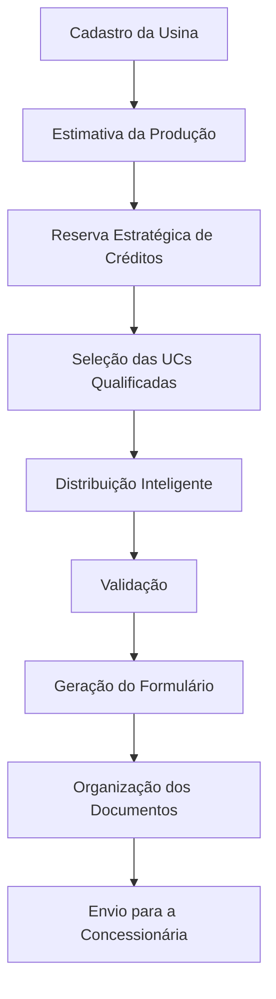
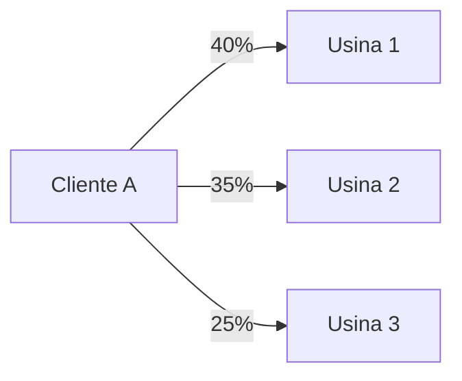

Especificação Funcional – Sistema de Rateio Inteligente do HUB 

> **Documentos relacionados:** [[ARCHITECTURE]] · [[VISAO]] · [[API_CONTRACTS]]

Objetivo
O módulo de Rateio do HUB tem como objetivo automatizar todo o processo de distribuição de energia entre Unidades Consumidoras (UCs), reduzindo o trabalho manual atualmente realizado em planilhas e garantindo que a distribuição seja otimizada conforme a produção das usinas, sazonalidade, regras da empresa e exigências da concessionária.
O sistema deverá ser capaz de calcular automaticamente os percentuais de rateio, gerar os formulários exigidos pela Copel, organizar a documentação necessária e validar todas as informações antes do envio.

Fluxo Geral

1. Cadastro da Usina
Cada usina deverá possuir informações suficientes para permitir o cálculo automático da produção energética.
Informações obrigatórias
Nome da usina
CEP
Latitude
Longitude
Número de módulos
Potência dos módulos (W)
Informações futuras (opcional)
Modelo dos módulos
Inclinação
Orientação
Tecnologia utilizada
Perdas estimadas

Estimativa de Produção
Atualmente o cálculo ocorre da seguinte forma:
CEP

↓

Latitude e Longitude
(LatLong)

↓

Irradiação Solar
(CRESESB)

↓

Planilha

↓

Produção Mensal
O objetivo futuro é que o HUB automatize esse processo.
Idealmente bastará informar:
CEP
Número de módulos
Potência dos módulos
e o restante será calculado automaticamente.
Enquanto essa automação não existir, será possível informar manualmente os dados de produção.

Dados de Produção
O HUB deverá armazenar:
Produção de Janeiro
Produção de Fevereiro
Produção de Março
...
Produção de Dezembro
Além de calcular automaticamente:
Produção anual
Produção média
Produção mínima
Produção máxima
Esses valores serão utilizados pelo motor de rateio.

2. Reserva Estratégica de Créditos
Como a produção das usinas varia ao longo do ano, o HUB deverá permitir reservar parte da produção durante os meses de maior irradiação para utilização nos meses de inverno.
Essa reserva deverá ser totalmente configurável.
Exemplo:
Sem reserva
5%
10%
15%
Valor personalizado
Cada empresa poderá definir sua própria estratégia.

3. Seleção das Unidades Consumidoras
Após calcular a produção disponível, o HUB deverá selecionar automaticamente os clientes elegíveis para participar do rateio.
Os critérios deverão ser totalmente configuráveis.
Critérios atualmente utilizados:
Data da assinatura do contrato
O contrato da Select Energy prevê um prazo máximo de 90 dias entre a assinatura e a conexão.
O HUB deverá considerar esse prazo na priorização dos clientes.
Data de leitura
A data de leitura da UC deverá ser posterior à data de leitura da usina.
A data de leitura corresponde ao dia em que a concessionária realiza a leitura para emissão da fatura.
Essa validação evita que alterações sejam enviadas fora da janela correta.
Critérios futuros
O sistema deverá permitir a inclusão de novos critérios conforme a necessidade de cada empresa.
Exemplos:
Cliente estratégico
Documentação completa
Pendências financeiras
Consumo mínimo
Consumo máximo
Região
Tipo de cliente

4. Estratégia de Distribuição
O HUB deverá permitir que uma mesma UC seja atendida por diversas usinas.
Exemplo:

Dessa forma, caso uma usina produza menos energia em determinado período, as demais poderão compensar essa diferença.
Esse modelo reduz impactos tanto para o cliente quanto para o proprietário da usina.

5. Cálculo do Rateio
O cálculo deverá considerar:
Consumo individual
Produção mensal
Produção média
Produção prevista para os próximos meses
Reserva estratégica
Créditos acumulados
Quando uma UC estiver vinculada a mais de uma usina, o consumo será dividido entre elas antes do cálculo dos percentuais.

Compensação para o inverno
Cada empresa poderá configurar quanto deseja acumular de créditos.
Exemplo:
Consumo atual
Consumo +5%
Consumo +10%
Consumo +15%
Consumo +20%
Valor personalizado
A Select Energy atualmente pretende utilizar aproximadamente 15%.

6. Modelos de Rateio
O HUB deverá permitir dois modelos.
Por prioridade
Distribuição baseada em regras previamente definidas.
Por porcentagem
Distribuição diretamente proporcional ao consumo.
A Select Energy utilizará apenas o modelo por porcentagem.

7. Usina Coringa
O sistema deverá permitir marcar determinadas usinas como "Usinas Coringa".
Essas usinas permanecerão parcialmente livres para absorver alterações futuras.
Objetivos:
Ajustes de inverno
Novos clientes
Mudanças inesperadas
Redistribuição rápida

8. Geração dos Formulários
Após finalizar os cálculos, o HUB deverá preencher automaticamente os formulários exigidos pela Copel.
Tipos suportados:
Autoconsumo Remoto
Condomínio
Consórcio
Cooperativa
Associação
Como o HUB será focado em Associações e Cooperativas, será possível definir um modelo padrão nas configurações da empresa.
Assim não será necessário escolher o formulário manualmente toda vez.

Dados utilizados
O formulário deverá ser preenchido automaticamente com:
Usina
Nome
Cliente
Nome
CPF/CNPJ
UC
Percentual de participação

Validação
Antes de permitir a geração do formulário, o HUB deverá validar:
Soma dos percentuais
Produção disponível
Percentual máximo de 100%
Diferenças insignificantes por arredondamento
Caso existam inconsistências, o sistema deverá impedir a geração.

9. Organização dos Documentos
Após gerar o formulário, o HUB deverá organizar automaticamente toda a documentação.
Documentos obrigatórios:
Pessoa Física
Documento oficial com foto.
Terceiros
Procuração
Documento do procurador
Documento do titular
Pessoa Jurídica
Documento do representante legal.
Quando necessário:
Contrato Social
Ata
Outros documentos comprobatórios
Termo de Adesão
Documento utilizado para comprovar que a UC beneficiária pertence ao empreendimento.
Esse documento normalmente aparece nas instruções complementares do formulário.

Organização automática
Todos os documentos serão classificados por categoria.
Exemplo:
Documento de Identificação
Procuração
Contrato Social
Estatuto
Ata
Termo de Adesão
Assim, durante a geração do processo, o HUB localizará automaticamente os documentos necessários.

10. Envio
A Copel aceita:
até 4 arquivos
PDF
máximo de 5 MB por arquivo
Hoje o processo é:
Selecionar arquivos
↓
Entrar no iLovePDF
↓
Juntar PDFs
↓
Salvar
↓
Enviar
No futuro o HUB poderá realizar essa etapa automaticamente, gerando os PDFs finais já organizados.

Adendos
Adendo 1 — Usina Coringa
É recomendável manter uma usina de maior capacidade como reserva operacional.
Ela será utilizada para:
redistribuição
inverno
novos clientes
emergências

Adendo 2 — Acúmulo de Créditos
A regra de compensação deverá ser configurável.
Exemplo:
Consumo

15%
para formação de créditos durante os meses de maior produção.

Adendo 3 — Organização dos PDFs
Todos os documentos, exceto o formulário, deverão ser agrupados automaticamente conforme as exigências da concessionária.

Sugestões para evolução futura
1. Motor de Rateio independente
Criar um serviço exclusivo responsável apenas pelo cálculo de distribuição.
RateioService

↓

Recebe

• Usinas
• Clientes
• Produção
• Consumo
• Configurações

↓

Calcula

↓

Retorna

• Percentuais
• Validações
• Alertas
Isso desacopla a inteligência do restante do HUB e facilita futuras alterações nas regras da Copel ou das empresas.

2. Sistema de Simulação
Antes de gerar qualquer formulário, permitir uma simulação completa do rateio.
Exemplo:
Produção prevista por usina
Consumo atendido
Reserva de créditos
Clientes impactados
Alertas de excesso ou insuficiência
Assim, o usuário poderá validar todo o cenário antes de efetivar as alterações.

3. Configurações totalmente parametrizáveis
Evitar regras fixas no sistema.
Itens configuráveis:
Percentual de reserva
Critérios de seleção
Modelo de rateio
Consumo adicional para formação de créditos
Formulário padrão
Estratégia operacional da empresa
Isso permitirá que o HUB seja utilizado por diferentes empresas sem necessidade de alterações no código.

4. Cadastro preparado para evolução
Mesmo que alguns dados não sejam utilizados inicialmente, o cadastro da usina deve ser pensado para suportar futuras integrações e cálculos mais avançados.
Exemplos:
Modelo dos módulos
Inclinação
Orientação
Tecnologia
Perdas
APIs meteorológicas
APIs de irradiância

5. Organização inteligente de documentos
Utilizar categorias em vez de documentos específicos.
Exemplo:
Documento de Identificação
Procuração
Contrato Social
Termo de Adesão
Estatuto
Ata
O motor de geração identifica automaticamente quais categorias são exigidas para cada tipo de processo, reduzindo erros e eliminando a necessidade de seleção manual.

Considerações finais
O módulo de Rateio do HUB não deve ser visto apenas como uma ferramenta para preencher formulários da concessionária. Seu principal valor está em atuar como um motor inteligente de gestão da geração distribuída, centralizando informações das usinas, clientes e documentos, aplicando regras configuráveis de distribuição, considerando a sazonalidade da produção, gerenciando reservas de créditos, validando automaticamente todos os cálculos e organizando a documentação necessária para envio. A geração dos formulários passa a ser apenas a etapa final de um processo muito mais amplo, automatizado e confiável, transformando o HUB em uma plataforma operacional para associações, cooperativas e empresas que administram geração distribuída.

